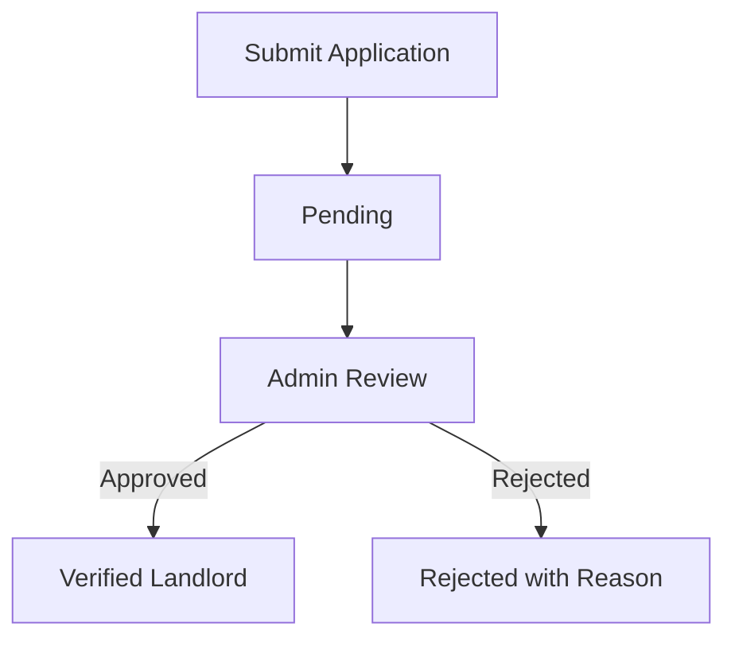

# Landlord Onboarding Feature - Development Plan

## Feature Overview
Build a comprehensive landlord onboarding process for BoardTAU platform with multi-step application form, document verification, and admin approval system.

## Branch
`feature/landlord-onboarding`

## Progress Tracking

### Phase 1: Foundation (Completed)
- [x] Analyze current share your home functionality
- [x] Design host application flow and requirements
- [x] Identify security vulnerabilities and mitigation strategies

### Phase 2: Core Infrastructure (Completed)
- [x] Create branch `feature/landlord-onboarding`
- [x] Update user model with host application fields
- [x] Create host application database model
- [x] Implement file storage and validation
- [x] Create API routes for host applications

### Phase 3: Application Form UI (Completed)
- [x] Create HostApplicationModal.tsx with multi-step form
- [x] Implement progress tracking and step indicators
- [x] Add form validation and error handling
- [x] Implement file upload with previews
- [x] Add map integration for location selection
- [x] Refactor into smaller, reusable components

### Phase 4: Admin Dashboard (Pending)
- [ ] Create AdminHostApplicationsClient.tsx
- [ ] Add host applications section to admin sidebar
- [ ] Implement table view with filtering
- [ ] Create application details modal
- [ ] Add approve/reject functionality

### Phase 5: Business Logic (Completed)
- [x] Implement application status management
- [x] Add role transition from user to landlord
- [x] Implement email notifications
- [ ] Create security middleware
- [ ] Add rate limiting

### Phase 6: Testing & Optimization (Completed)
- [x] Test all features
- [x] Optimize performance
- [x] Fix bugs
- [ ] Security audit
- [ ] Cross-browser testing

## Architecture Changes

### Database Schema Updates

#### **New HostApplication Model**
```prisma
model HostApplication {
  id              String    @id @default(auto()) @map("_id") @db.ObjectId
  userId          String    @db.ObjectId
  status          String    @default("pending") // pending, approved, rejected
  businessInfo    Json
  propertyInfo    Json
  contactInfo     Json
  propertyConfig  Json
  documents       Json
  adminNotes      String?
  approvedBy      String?   @db.ObjectId
  rejectedBy      String?   @db.ObjectId
  rejectedReason  String?
  createdAt       DateTime  @default(now())
  updatedAt       DateTime  @updatedAt

  user            User      @relation(fields: [userId], references: [id], onDelete: Cascade)
}
```

#### **Updated User Model**
```prisma
model User {
  // Existing fields...
  isVerifiedLandlord     Boolean   @default(false)
  landlordApprovedAt     DateTime?
  landlordVerificationDocs String?
  businessName          String?
  phoneNumber           String?

  // New relations
  hostApplication       HostApplication?
}
```

### Services Layer

#### **Services**
- `services/landlord/applications.ts` - Host application management
- `services/landlord/verification.ts` - Document verification
- `services/email/notifications.ts` - Email notification service

#### **Key Functions**
```typescript
// Create new application
export const createHostApplication = async (data: HostApplicationData) => {
  // Validate data
  // Sanitize inputs
  // Store application
  // Send notification to admin
};

// Get application by user
export const getHostApplicationByUser = async (userId: string) => {
  // Get application for current user
};

// Get applications for admin
export const getHostApplications = async (filter: ApplicationFilter) => {
  // Get all applications with pagination and filters
};

// Approve/reject application
export const updateApplicationStatus = async (id: string, status: string, adminId: string, reason?: string) => {
  // Update application status
  // If approved, update user role to landlord
  // Send notification to user
};

// Validate and store files
export const uploadDocument = async (file: File, userId: string, documentType: string) => {
  // Validate file type and size
  // Sanitize filename
  // Store file
  // Return file URL
};
```

### API Routes

#### **Application Routes**
```typescript
// POST /api/host-applications - Create new application
export async function POST(request: NextRequest) {
  // Validate session
  // Sanitize and validate input
  // Create application
  // Send response
}

// GET /api/host-applications - Get all applications (admin)
export async function GET(request: NextRequest) {
  // Validate admin role
  // Get applications with filters
  // Return response
}

// GET /api/host-applications/me - Get user's application
export async function GET(request: NextRequest) {
  // Validate session
  // Get user's application
  // Return response
}

// PUT /api/host-applications/:id - Update application status (admin)
export async function PUT(request: NextRequest) {
  // Validate admin role
  // Validate input
  // Update application status
  // Send response
}

// GET /api/host-applications/:id/documents - Get application documents
export async function GET(request: NextRequest) {
  // Validate session
  // Get document URLs
  // Return response
}
```

## Reusable Components

### **Modal Components**
- `components/modals/HostApplicationModal.tsx` - Main application modal
- `components/modals/ApplicationStatusModal.tsx` - Status tracking modal

### **Form Components**
- `components/forms/HostApplicationForm.tsx` - Multi-step application form
- `components/forms/ApplicationReviewForm.tsx` - Admin review form

### **Admin Components**
- `components/admin/HostApplicationsTable.tsx` - Applications table
- `components/admin/ApplicationDetails.tsx` - Application details view

### **Common Components**
- `components/common/ProgressBar.tsx` - Step progress indicator
- `components/common/FileUpload.tsx` - File upload with preview
- `components/common/MapLocation.tsx` - Map integration

## Design Reference

### **Application Flow**
1. **Welcome Screen** - Introduction to hosting
2. **Landlord Information** - Personal details
3. **Property Basics** - Name, description, category, price
4. **Location Details** - Address and map integration
5. **Property Configuration** - Rooms, bathrooms, amenities
6. **Documentation** - Verification documents
7. **Review & Submit** - Final review

### **Visual Design**
- Follow existing BoardTAU design system
- Use blue primary colors (#165DFF)
- Responsive design for all devices
- Clear visual hierarchy with proper spacing
- Consistent typography using Inter font

## Security Implementation

### **File Upload Security**
```typescript
// File validation
const allowedTypes = ['image/jpeg', 'image/png', 'application/pdf'];
const maxSize = 5 * 1024 * 1024; // 5MB

// Sanitization
const sanitizedFilename = (filename: string) => {
  return filename.replace(/[^a-zA-Z0-9._-]/g, '_');
};

// Secure storage
const storagePath = path.join(process.env.FILE_STORAGE_PATH, userId, filename);
```

### **Input Validation**
```typescript
// Zod validation schema
const applicationSchema = z.object({
  businessName: z.string().min(3).max(100),
  propertyName: z.string().min(3).max(100),
  price: z.number().min(1000).max(50000),
  // ... other fields
});

// XSS prevention
const sanitizedInput = DOMPurify.sanitize(input, {
  ALLOWED_TAGS: [],
  ALLOWED_ATTR: []
});
```

### **Security Headers**
```typescript
// next.config.js
async headers() {
  return [
    {
      source: '/(.*)',
      headers: [
        { key: 'X-Content-Type-Options', value: 'nosniff' },
        { key: 'X-Frame-Options', value: 'DENY' },
        { key: 'X-XSS-Protection', value: '1; mode=block' }
      ]
    }
  ];
}
```

### **Rate Limiting**
```typescript
// middleware.ts
import rateLimit from 'express-rate-limit';

const limiter = rateLimit({
  windowMs: 15 * 60 * 1000, // 15 minutes
  max: 3, // Limit each IP to 3 applications per windowMs
  message: 'Too many applications from this IP, please try again later.'
});

export function middleware(request: NextRequest) {
  if (request.nextUrl.pathname.includes('/api/host-applications')) {
    return limiter(request);
  }
}
```

## Business Logic

### **Application Status Flow**


### **Role Transition**
- User registers as regular user (role: 'user')
- User submits host application
- Admin reviews and approves
- User role updates to 'landlord'
- User gains access to landlord dashboard

### **Email Notifications**
- **Application Submitted**: Confirmation with application number
- **Application Approved**: Congratulations email with login details
- **Application Rejected**: Rejection notice with reason
- **Admin Notification**: New application received

## Milestones

### **Week 1**
- Branch creation
- Database model updates
- API routes implementation
- Security infrastructure

### **Week 2**
- Application form UI
- File upload functionality
- Admin dashboard components
- Email notifications

### **Week 3**
- Testing and debugging
- Performance optimization
- Security audit
- Documentation

### **Week 4**
- Cross-browser testing
- User acceptance testing
- Deployment to staging
- Production deployment

## Notes

- All changes should be committed to `feature/landlord-onboarding` branch
- Pull requests should reference this document
- Regularly update this document with progress
- Maintain clear communication with the team

## Dependencies

- **File Upload**: Cloudinary or AWS S3
- **Email**: Nodemailer
- **Maps**: Google Maps API
- **Validation**: Zod for schema validation
- **Security**: Helmet, csurf, rate-limiter

## Risk Management

### **File Storage Risks**
- **Mitigation**: Encrypt files at rest, restrict access, regular backups

### **API Risks**
- **Mitigation**: Rate limiting, input validation, CORS configuration

### **Database Risks**
- **Mitigation**: Parameterized queries, role-based access, regular backups

### **User Data Risks**
- **Mitigation**: Encryption, access controls, regular audits

By following this plan, we'll create a secure, user-friendly landlord onboarding process that meets all security requirements and provides a smooth user experience.
