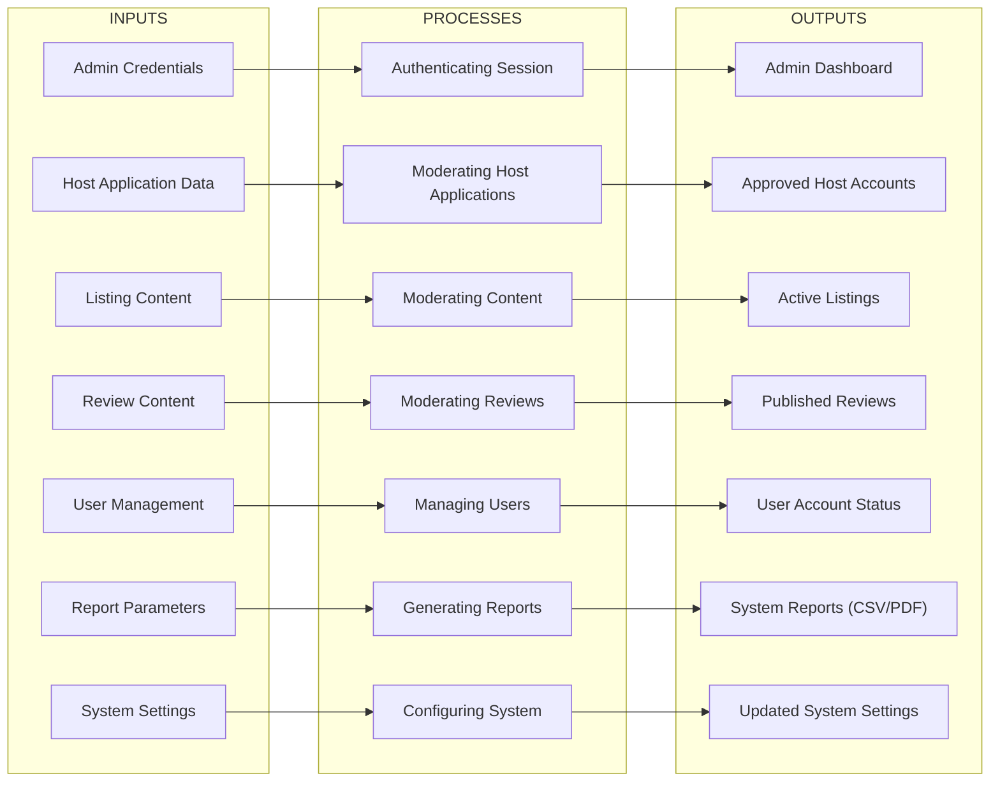
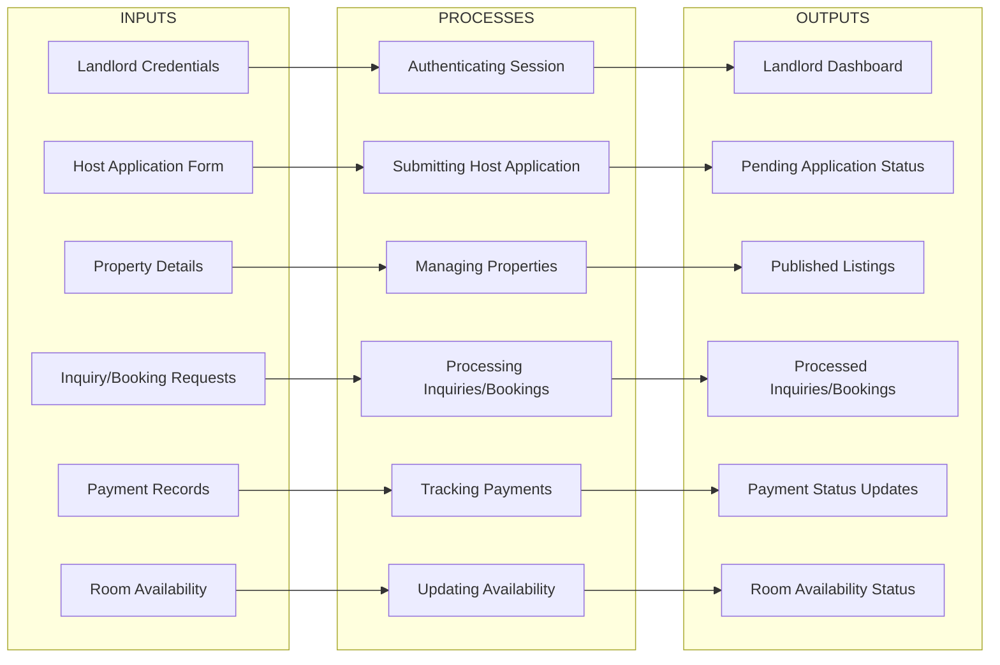
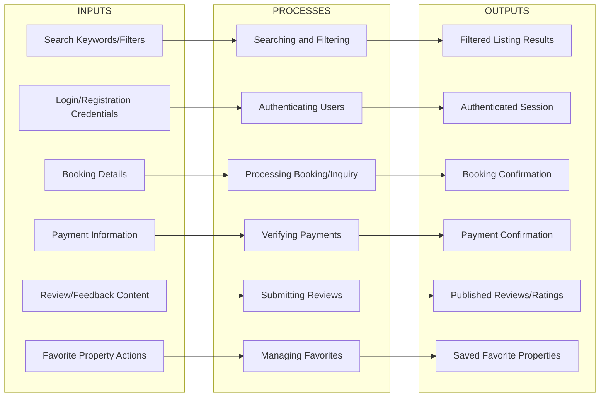

# Input Process Output (IPO) Documentation for BoardTAU

## Comprehensive Guide for Capstone Panel Questions

This document provides detailed explanations for each process in all three Input-Process-Output (IPO) diagrams. It serves as a comprehensive guide to help you answer questions from your capstone panel about how the BoardTAU system works.

---

## Table of Contents

1. [Admin IPO Diagram](#admin-ipo-diagram)
2. [Landlord IPO Diagram](#landlord-ipo-diagram)
3. [End-User IPO Diagram](#end-user-ipo-diagram)
4. [Key System Components](#key-system-components)
5. [Data Flow Between Processes](#data-flow-between-processes)
6. [Implementation Details](#implementation-details)

---

## Admin IPO Diagram

### Detailed Process Explanations

#### 1. Authenticating Session (H)
**Input:** Admin Credentials
**Process Description:** This process handles the authentication of system administrators. When an admin attempts to log in:
- The system validates the provided credentials against the user database
- Checks if the user has the 'admin' role
- If valid, creates a secure session and stores session information
- Sets appropriate cookies and security tokens
- Redirects the admin to the dashboard

**Key Features:**
- Role-based access control
- Password hashing and validation
- Session management
- Security checks and monitoring

**Output:** Admin Dashboard - A comprehensive overview of system status, pending items, and key metrics.

#### 2. Moderating Host Applications (I)
**Input:** Host Application Data
**Process Description:** This process manages the review and approval of landlord applications. When a new host application is submitted:
- The system notifies admins of the new application
- Admin reviews the application details and attached documents
- Verifies business information, property details, and contact information
- Checks for completeness and compliance with platform rules
- Makes decision to approve, reject, or request additional information

**Key Features:**
- Application tracking system
- Document verification process
- Decision logging and audit trails
- Communication with applicants

**Output:** Approved Host Accounts - Landlords who have been approved to list properties on the platform.

#### 3. Moderating Content (J)
**Input:** Listing Content
**Process Description:** This process reviews and approves property listings before they become visible to end-users. When a new listing is submitted:
- The system checks for appropriate content and compliance
- Admin reviews listing details, images, pricing, and amenities
- Verifies that the property meets platform standards
- Ensures all required fields are complete and accurate
- Approves listings or rejects with feedback

**Key Features:**
- Content validation and screening
- Image moderation
- Pricing verification
- Compliance checks

**Output:** Active Listings - Properties that are visible and available for booking by end-users.

#### 4. Moderating Reviews (K)
**Input:** Review Content
**Process Description:** This process manages the moderation of user reviews. When a new review is submitted:
- The system checks for inappropriate content using automated filters
- Admin reviews the review for spam, offensive language, or inaccuracies
- Verifies that the review is from a legitimate user who has booked the property
- Approves the review or removes it with justification

**Key Features:**
- Automated content filtering
- Review verification
- Spam detection
- Quality control

**Output:** Published Reviews - Reviews that are visible to all users and contribute to property ratings.

#### 5. Managing Users (L)
**Input:** User Management
**Process Description:** This process handles user account management and administration. Admins can:
- View all user accounts with detailed information
- Activate or deactivate user accounts
- Change user roles (end-user → landlord → admin)
- Update user profile information
- Delete user accounts

**Key Features:**
- User account lifecycle management
- Role-based permissions
- Account recovery and password resets
- User activity tracking

**Output:** User Account Status - Updated information about user accounts, including active/inactive status and role assignments.

#### 6. Generating Reports (M)
**Input:** Report Parameters
**Process Description:** This process generates various reports for system analysis and decision-making. When a report is requested:
- Admin specifies report parameters (date range, metrics, format)
- System collects data from multiple databases and services
- Processes and aggregates data
- Generates report in CSV format or provides print/PDF functionality through browser

**Key Features:**
- Custom report generation
- Real-time data processing
- CSV export functionality
- Print/PDF functionality via browser
- Scheduled report generation (planned feature)

**Output:** System Reports (CSV/PDF) - Comprehensive reports on users, listings, bookings, reviews, and payments.

#### 7. Configuring System (N)
**Input:** System Settings
**Process Description:** This process manages the configuration of platform settings and parameters. Admins can:
- Configure payment gateway settings (Stripe)
- Set platform fees and commission rates
- Configure content moderation rules
- Manage notification templates
- Update system parameters

**Key Features:**
- Centralized configuration management
- Feature toggles and flags
- System performance monitoring
- Security configuration

**Output:** Updated System Settings - Applied configuration changes that affect system behavior.

---

## Landlord IPO Diagram

### Detailed Process Explanations

#### 1. Authenticating Session (G)
**Input:** Landlord Credentials
**Process Description:** This process handles the authentication of landlords. When a landlord attempts to log in:
- System validates credentials against user database
- Checks if the user has landlord privileges
- Creates secure session and stores session information
- Redirects to landlord dashboard

**Key Features:**
- Role-based authentication
- Session management
- Account lockout protection

**Output:** Landlord Dashboard - A comprehensive overview of their properties, bookings, payments, and inquiries.

#### 2. Submitting Host Application (H)
**Input:** Host Application Form
**Process Description:** This process manages the submission of landlord applications. Prospective landlords can:
- Fill out application form with personal and business information
- Upload verification documents (ID, business permits)
- Submit application for review

**Key Features:**
- Multi-step application process
- Document upload and validation
- Application status tracking
- Email notifications

**Output:** Pending Application Status - Application is submitted and awaiting admin review.

#### 3. Managing Properties (I)
**Input:** Property Details
**Process Description:** This process handles property listing management. Landlords can:
- Create new property listings with detailed information
- Upload property images
- Edit existing listings
- Manage property amenities and rules
- Delete listings

**Key Features:**
- Rich text property description editor
- Image upload and management
- Amenity and rule selection
- Listing status management

**Output:** Published Listings - Properties available for booking by end-users.

#### 4. Processing Inquiries/Bookings (J)
**Input:** Inquiry/Booking Requests
**Process Description:** This process manages the handling of inquiries and bookings. Landlords can:
- View incoming inquiries and booking requests
- Respond to inquiries (accept/reject)
- Manage booking details
- Send confirmation notifications

**Key Features:**
- Inquiry tracking system
- Response templates
- Booking confirmation
- Notification system

**Output:** Processed Inquiries/Bookings - Inquiries that have been responded to and bookings that have been confirmed.

#### 5. Tracking Payments (K)
**Input:** Payment Records
**Process Description:** This process tracks and manages payments. Landlords can:
- View payment history
- Check payment status
- Generate payment reports
- Manage refund requests

**Key Features:**
- Real-time payment tracking
- Payment status management
- Refund processing
- Payment history

**Output:** Payment Status Updates - Updated information about payment status and history.

#### 6. Updating Availability (L)
**Input:** Room Availability
**Process Description:** This process manages room availability. Landlords can:
- Set room availability dates
- Update room pricing
- Manage booking restrictions
- View availability calendar

**Key Features:**
- Availability calendar management
- Price adjustment tools
- Booking restriction settings
- Real-time availability updates

**Output:** Room Availability Status - Updated information about room availability and pricing.

---

## End-User IPO Diagram

### Detailed Process Explanations

#### 1. Searching and Filtering (G)
**Input:** Search Keywords/Filters
**Process Description:** This process handles property search and filtering. Users can:
- Search for properties using keywords
- Apply filters (price range, location, amenities, room type)
- Sort results by various criteria

**Key Features:**
- Full-text search functionality
- Advanced filtering options
- Sorting capabilities
- Search result caching

**Output:** Filtered Listing Results - Properties that match the search criteria and filters.

#### 2. Authenticating Users (H)
**Input:** Login/Registration Credentials
**Process Description:** This process handles user authentication and registration. Users can:
- Register for a new account
- Log in to existing accounts
- Reset passwords
- Update account information

**Key Features:**
- User registration and login
- Password recovery
- Account verification
- Session management

**Output:** Authenticated Session - Secure session for accessing protected features.

#### 3. Processing Booking/Inquiry (I)
**Input:** Booking Details
**Process Description:** This process handles booking and inquiry processing. Users can:
- Book properties directly
- Send inquiries to landlords
- View booking history
- Manage bookings

**Key Features:**
- Booking system integration
- Inquiry management
- Booking history
- Cancellation management

**Output:** Booking Confirmation - Confirmation that the booking has been processed.

#### 4. Verifying Payments (J)
**Input:** Payment Information
**Process Description:** This process handles payment verification and processing. Users can:
- Enter payment information
- Complete payment transactions
- View payment history
- Manage payment methods

**Key Features:**
- Secure payment processing
- Payment method management
- Payment history
- Refund processing

**Output:** Payment Confirmation - Confirmation that the payment has been processed.

#### 5. Submitting Reviews (K)
**Input:** Review/Feedback Content
**Process Description:** This process handles review submission and management. Users can:
- Submit reviews for properties they have stayed in
- Edit or delete their reviews
- View reviews from other users
- Rate properties

**Key Features:**
- Review submission
- Review management
- Rating system
- Review visibility control

**Output:** Published Reviews/Ratings - Reviews and ratings that are visible to all users.

#### 6. Managing Favorites (L)
**Input:** Favorite Property Actions
**Process Description:** This process manages user favorite properties. Users can:
- Add properties to favorites
- Remove properties from favorites
- View favorite properties
- Organize favorites

**Key Features:**
- Property favoriting
- Favorite property management
- Quick access to favorites
- Searching and filtering favorites

**Output:** Saved Favorite Properties - Properties that the user has marked as favorites.

---

## Key System Components

### 1. Authentication System
- Handles user login and registration
- Role-based access control
- Session management
- Password hashing and validation

### 2. Property Management System
- Property listing creation and management
- Image upload and management
- Amenity and rule selection
- Availability management

### 3. Booking System
- Booking and inquiry processing
- Availability check
- Confirmation and cancellation
- Payment integration

### 4. Review System
- Review submission and management
- Rating system
- Review visibility control
- Spam detection and moderation

### 5. Payment System
- Payment processing
- Payment history
- Refund management
- Multiple payment methods

### 6. Reporting System
- Report generation
- Real-time data processing
- Custom report creation
- Multiple export formats

---

## Data Flow Between Processes

### Admin User Flow
1. Admin logs in
2. Views dashboard
3. Reviews applications
4. Moderates content
5. Manages users
6. Generates reports
7. Configures system

### Landlord User Flow
1. Landlord logs in
2. Views dashboard
3. Submits application (if not approved)
4. Manages properties
5. Processes inquiries/bookings
6. Tracks payments
7. Updates availability

### End-User Flow
1. User searches properties
2. Filters results
3. Views property details
4. Logs in/registers
5. Books property
6. Pays for booking
7. Leaves review
8. Manages favorites

---

## Implementation Details

### Technology Stack
- **Frontend:** React, Next.js, Tailwind CSS
- **Backend:** Node.js, Next.js API routes
- **Database:** PostgreSQL with Prisma ORM
- **Authentication:** NextAuth.js
- **Payments:** Stripe
- **Hosting:** Vercel
- **Images:** Cloudinary

### Key Features and Functionalities
- Role-based access control
- Responsive design
- Real-time updates
- Secure payment processing
- Image optimization
- Search and filtering
- Review system
- Booking management

---

## FAQ for Panel Questions

### Q: How does the host application process work?
A: Prospective landlords submit an application form with personal and business information, along with verification documents. Admins review the applications and approve or reject them based on platform criteria.

### Q: How are payments processed?
A: Payments are processed using Stripe integration. Users enter payment information on a secure checkout page, and the system handles payment verification and processing.

### Q: How are reviews moderated?
A: Reviews are automatically filtered for inappropriate content, then manually reviewed by admins to ensure quality and compliance.

### Q: How is property availability managed?
A: Landlords can set room availability dates and pricing through the dashboard. The system automatically updates availability based on bookings and cancellations.

### Q: How does the search functionality work?
A: The search system uses full-text search and advanced filtering to help users find properties that match their criteria. Results are sorted by relevance and price.

---

This comprehensive documentation will help you prepare for your capstone panel defense by providing detailed explanations of each process and functionality of the BoardTAU system.
