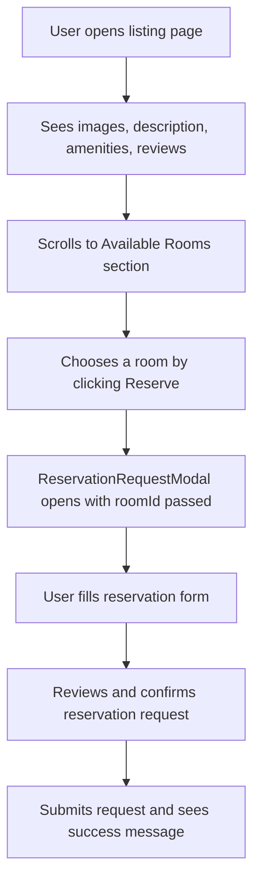

# STEP 1 IMPLEMENTATION REPORT

## 1. New Components

### AvailableRoomsSection.tsx
- **File Path**: `components/listings/detail/AvailableRoomsSection.tsx`
- **Props**:
  - `rooms[]`: Array of available rooms for the listing
  - `listingId`: Unique identifier of the listing
  - `listingName`: Name of the listing
  - `onSubmit`: Callback function to handle reservation request submission
  - `isLoading`: Loading state indicator
- **Responsibilities**:
  - Displays available rooms in a responsive grid layout
  - Each room card shows:
    - Room image
    - Room name
    - Price per month
    - Capacity
    - Available slots
    - Room type
    - Status indicator
  - Each card includes a "Reserve" button that opens the reservation modal with the selected room

### ReservationRequestModal.tsx
- **File Path**: `components/modals/ReservationRequestModal.tsx`
- **Props**:
  - `listingName`: Name of the listing
  - `room`: Selected room object
  - `onSubmit`: Callback function to handle form submission
  - `isLoading`: Loading state indicator
- **Responsibilities**:
  - Displays reservation form with selected room information
  - Collects reservation details including:
    - Move-in date
    - Stay duration
    - Number of occupants
    - Role
    - Pets information
    - Smoking preference
    - Contact method
    - Optional message to owner
  - Review and confirm step
  - Success state after submission

## 2. Updated Components

### ListingDetailsClient.tsx
- **File Path**: `components/listings/detail/ListingDetailsClient.tsx`
- **Changes**:
  - Added import for `AvailableRoomsSection`
  - Added AvailableRoomsSection component to the JSX
  - Passed required props to AvailableRoomsSection
  - Updated sidebar button text from "Inquire Now" to "Check Availability"
  - Changed sidebar content to inform users about the new reservation flow
  - Removed old InquiryModal usage

### InquiryModal.tsx → ReservationRequestModal.tsx
- **File Path**: `components/modals/ReservationRequestModal.tsx` (renamed from InquiryModal.tsx)
- **Changes**:
  - Removed room selection step (Step 1)
  - Updated modal title to "Reservation Request"
  - Added selected room information display
  - Changed step numbering (Step 2 → Step 1, Step 3 → Step 2)
  - Added prop for selected room instead of rooms array
  - Updated success message
  - Changed modal window name to include room ID for unique modal instances

## 3. Data Flow

```
page.tsx (listing page)
    ↓
getListingById() → listing.rooms
    ↓
ListingDetailsClient.tsx
    ↓
AvailableRoomsSection.tsx
    ↓
ReservationRequestModal.tsx (with roomId, listingId passed)
    ↓
handleInquiry() → API call to /api/inquiries
```

## 4. Notes / Observations

- Step 1 of the reservation flow (room selection) is now implemented on the listing page
- Users must select a room first before opening the reservation modal
- The modal now receives the selected room's data as props and no longer handles room selection
- The sidebar button text was updated to "Check Availability" to reflect the new flow
- The modal is simplified and focuses only on collecting reservation details
- No payment or reservation creation logic is implemented yet
- The implementation reuses existing rooms data already loaded on the listing page
- The new section is responsive and works on mobile devices

## 5. UX Flow Diagram


