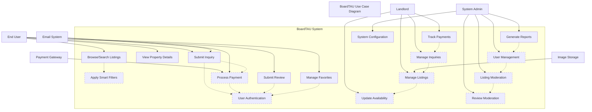

# BoardTAU Use Case Diagram

## Overview

This use case diagram follows your instructor's clean, structured format. It shows the interactions between three main actors: **End Users** (students, instructors, faculty, staff), **Landlords/Property Owners**, and **System Administrators** with the BoardTAU system.

## Use Case Diagram

## Actor Descriptions

### Primary Actors
- **End User**: Students, instructors, faculty, and staff seeking boarding house accommodations near Tarlac Agricultural University
- **Landlord/Property Owner**: Individuals who manage and rent out boarding houses on the platform
- **System Administrator**: Personnel responsible for managing and maintaining the BoardTAU system

### External Actors
- **Payment Gateway**: Handles digital payment processing (Stripe, GCash, Maya via PayMongo)
- **Email System**: Sends notifications, confirmations, and updates to users
- **Image Storage**: Manages property image uploads and storage

## Use Case Descriptions

### End User Use Cases

| Use Case | Description |
|----------|-------------|
| **User Authentication** | User registration, login, and account management. |
| **Browse/Search Listings** | View available boarding house listings and perform basic searches. |
| **Apply Smart Filters** | Advanced filtering options including price, amenities, distance from TAU, and specific college locations. |
| **View Property Details** | Access detailed information about specific properties including images, amenities, and location maps. |
| **Submit Inquiry** | Send reservation inquiries to property owners with stay details. |
| **Process Payment** | Complete digital payments using various payment methods. |
| **Submit Review** | Provide feedback and ratings for boarding houses after stay. |
| **Manage Favorites** | Save and organize favorite properties for future reference. |

### Landlord Use Cases

| Use Case | Description |
|----------|-------------|
| **Manage Listings** | Create, edit, and manage property listings including images and details. |
| **Manage Inquiries** | Review and respond to reservation inquiries from potential tenants. |
| **Update Availability** | Manage room availability and occupancy status. |
| **Track Payments** | Monitor payment status and history for reservations. |

### System Administrator Use Cases

| Use Case | Description |
|----------|-------------|
| **User Management** | Manage user accounts, roles, and permissions for all users. |
| **Listing Moderation** | Review, approve, reject, or flag property listings for quality control. |
| **Review Moderation** | Approve, remove, or flag user reviews to maintain platform integrity. |
| **System Configuration** | Configure platform settings, payment integrations, and content moderation rules. |
| **Generate Reports** | Create system reports and view analytics on platform usage and performance. |

## Relationship Types

### Include Relationships («include»)
- Require the use of another use case to complete functionality
- Examples: `Submit Inquiry` includes `User Authentication`, `Process Payment` includes `User Authentication`

### Extend Relationships («extend»
- Optional functionality that extends another use case
- Examples: `Browse/Search Listings` extends to `Apply Smart Filters`

## System Scope

The diagram covers all functional requirements from Chapter 1, including:
- **User interface components** for end users, landlords, and administrators
- **Core functionality** including listing management, search, inquiry, and payment processes
- **Quality attributes** support through moderation and system monitoring

This structured use case diagram follows your instructor's example and provides a clear, professional representation of the BoardTAU system's functionality.
