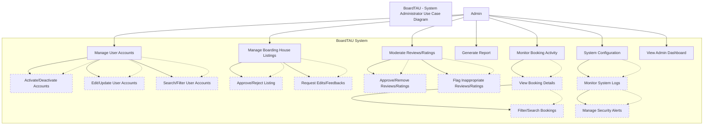

# BoardTAU Use Case Diagram

## Overview

This use case diagram shows the interactions between three main actors: **End Users** (students, instructors, faculty, staff), **Landlords/Property Owners**, and **System Administrators** with the BoardTAU system. It is based on the updated diagrams and TASK-ANALYSIS.md.

## Use Case Diagrams

### End User and Landlord Use Cases
```mermaid
graph TD
    title[BoardTAU - End User and Landlord Use Case Diagram]

    %% Actors
    User[End User]
    Landlord[Landlord]

    %% System Boundary
    subgraph BoardTAU System
        %% End User Use Cases
        UC1[Browse/Search Boarding Houses]
        UC2[View Boarding House Details]
        UC3[User Authentication (Register/Login)]
        UC4[Add property to favorites]
        UC5[Submit Review & Rating]
        UC6[Update User Profile]
        UC7[Initiate Inquiry Request]
        UC8[View Inquiry Status]
        UC9[Make Payment (Stripe)]
        UC10[Receive Success Reservation Notification]
        UC11[Apply Smart Filters (Budget/Amenities/Distance)]
        UC12[Approve/Reject Inquiry Request]
        UC13[Inquiry Notification]
        UC14[Make Reservation]

        %% Landlord Use Cases
        UC15[Manage Boarding House Listings]
        UC16[Update Room Availability]
        UC17[Manage Incoming Inquiry Requests]
        UC18[View Landlord Dashboard]
        UC19[Update boarding house listing room status]
        UC20[View Payment History]
        UC21[Generate Reports]
        UC22[Upload Boarding House Photos]
    end

    %% Actor Connections
    User --> UC1
    User --> UC2
    User --> UC3
    User --> UC4
    User --> UC5
    User --> UC6
    User --> UC7
    User --> UC8

    Landlord --> UC15
    Landlord --> UC16
    Landlord --> UC17
    Landlord --> UC18
    Landlord --> UC19
    Landlord --> UC20
    Landlord --> UC21

    %% End User Flow
    UC7 --> UC12
    UC12 --> UC13
    UC13 --> UC14
    UC14 --> UC9
    UC9 --> UC10

    %% Relationships
    UC1 -.-> UC11:::extend
    UC15 -.-> UC22:::extend
    UC7 -.-> UC3:::include
    UC12 -.-> UC3:::include
    UC13 -.-> UC12:::include
    UC14 -.-> UC13:::include
    UC9 -.-> UC14:::include
    UC10 -.-> UC9:::include

    %% Styles
    classDef extend stroke-dasharray: 5,5;
    classDef include stroke-dasharray: 5,5;
```

### System Administrator Use Cases

```mermaid
graph TD
    title[BoardTAU - System Administrator Use Case Diagram]

    %% Actors
    Admin[Admin]

    %% System Boundary
    subgraph BoardTAU System
        %% Admin Use Cases
        UC1[Manage User Accounts]
        UC2[Activate/Deactivate Accounts]
        UC3[Edit/Update User Accounts]
        UC4[Search/Filter User Accounts]
        UC5[Manage Boarding House Listings]
        UC6[Approve/Reject Listing]
        UC7[Request Edits/Feedbacks]
        UC8[Moderate Reviews/Ratings]
        UC9[Approve/Remove Reviews/Ratings]
        UC10[Flag Inappropriate Reviews/Ratings]
        UC11[Generate Report]
        UC12[Monitor Booking Activity]
        UC13[View Booking Details]
        UC14[Filter/Search Bookings]
        UC15[System Configuration]
        UC16[Monitor System Logs]
        UC17[Manage Security Alerts]
        UC18[View Admin Dashboard]
    end

    %% Actor Connections
    Admin --> UC1
    Admin --> UC5
    Admin --> UC8
    Admin --> UC11
    Admin --> UC12
    Admin --> UC15
    Admin --> UC18

    %% Subtask Relationships
    UC1 --> UC2
    UC1 --> UC3
    UC1 --> UC4
    UC5 --> UC6
    UC5 --> UC7
    UC8 --> UC9
    UC8 --> UC10
    UC12 --> UC13
    UC13 --> UC14
    UC15 --> UC16
    UC16 --> UC17

    %% Include Relationships
    UC1 -.-> UC2:::include
    UC1 -.-> UC3:::include
    UC1 -.-> UC4:::include
    UC5 -.-> UC6:::include
    UC5 -.-> UC7:::include
    UC8 -.-> UC9:::include
    UC8 -.-> UC10:::include
    UC12 -.-> UC13:::include
    UC13 -.-> UC14:::include
    UC15 -.-> UC16:::include
    UC16 -.-> UC17:::include

    %% Styles
    classDef include stroke-dasharray: 5,5;
```

## Actor Descriptions

### Primary Actors
- **End User**: Students, instructors, faculty, and staff seeking boarding house accommodations near Tarlac Agricultural University
- **Landlord/Property Owner**: Individuals who manage and rent out boarding houses on the platform
- **System Administrator**: Personnel responsible for managing and maintaining the BoardTAU system

## Use Case Descriptions

### End User Use Cases

| Use Case | Description |
|----------|-------------|
| **Browse/Search Boarding Houses** | View available boarding house listings and perform basic searches. |
| **View Boarding House Details** | Access detailed information about specific properties including images, amenities, and location maps. |
| **User Authentication (Register/Login)** | User registration, login, and session management. |
| **Add property to favorites** | Save properties to a favorites list for future reference. |
| **Submit Review & Rating** | Provide feedback and ratings for boarding houses after stay. |
| **Update User Profile** | Modify and update user profile information. |
| **Initiate Inquiry Request** | Start the process of inquiring about a boarding house. |
| **View Inquiry Status** | Check the status of submitted inquiries. |
| **Make Payment (Stripe)** | Complete digital payments using Stripe. |
| **Receive Success Reservation Notification** | Get notified when a reservation is successfully made. |
| **Apply Smart Filters (Budget/Amenities/Distance)** | Advanced filtering options including budget, amenities, and distance from TAU. |

### Landlord Use Cases

| Use Case | Description |
|----------|-------------|
| **Manage Boarding House Listings** | Create, edit, and manage property listings including images and details. |
| **Update Room Availability** | Manage room availability and occupancy status. |
| **Manage Incoming Inquiry Requests** | Review and respond to reservation inquiries from potential tenants. |
| **View Landlord Dashboard** | Access an overview of property statistics and performance metrics. |
| **Update boarding house listing room status** | Activate/deactivate listings and update their visibility. |
| **View Payment History** | Monitor payment status and history for reservations. |
| **Generate Reports** | Create reports on property performance and tenant activity. |
| **Upload Boarding House Photos** | Add and manage property images. |

### System Administrator Use Cases

| Use Case | Description |
|----------|-------------|
| **Manage User Accounts** | Create, edit, and manage user accounts and roles. |
| **Activate/Deactivate Accounts** | Enable or disable user accounts. |
| **Edit/Update User Accounts** | Modify user account information. |
| **Search/Filter User Accounts** | Search and filter through user accounts. |
| **Manage Boarding House Listings** | Review and moderate property listings. |
| **Approve/Reject Listing** | Approve or reject property listings. |
| **Request Edits/Feedbacks** | Request changes to property listings from landlords. |
| **Moderate Reviews/Ratings** | Review and manage user reviews and ratings. |
| **Approve/Remove Reviews/Ratings** | Approve or remove user reviews. |
| **Flag Inappropriate Reviews/Ratings** | Identify and flag inappropriate reviews. |
| **Generate Report** | Create system reports and analytics. |
| **Monitor Booking Activity** | Track and monitor booking activity. |
| **View Booking Details** | Access detailed booking information. |
| **Filter/Search Bookings** | Filter and search through bookings. |
| **System Configuration** | Configure system settings and parameters. |
| **Monitor System Logs** | Track system logs and activity. |
| **Manage Security Alerts** | Handle security alerts and notifications. |
| **View Admin Dashboard** | Access an overview of system performance and activity. |

## Relationship Types

### Include Relationships («include»)
- Require the use of another use case to complete functionality
- Examples: `Initiate Inquiry Request` includes `User Authentication`, `Approve/Reject Inquiry Request` includes `User Authentication`

### Extend Relationships («extend»)
- Optional functionality that extends another use case
- Examples: `Browse/Search Boarding Houses` extends to `Apply Smart Filters`, `Manage Boarding House Listings` extends to `Upload Boarding House Photos`

## System Scope

The diagrams cover all functional requirements from the task analysis, including:
- **User interface components** for end users, landlords, and administrators
- **Core functionality** including listing management, search, inquiry, and payment processes
- **Quality attributes** support through moderation and system monitoring
- **Detailed sub-tasks** for each main use case, providing a comprehensive view of system functionality

This structured use case diagram follows the updated requirements and provides a clear, professional representation of the BoardTAU system's functionality.
