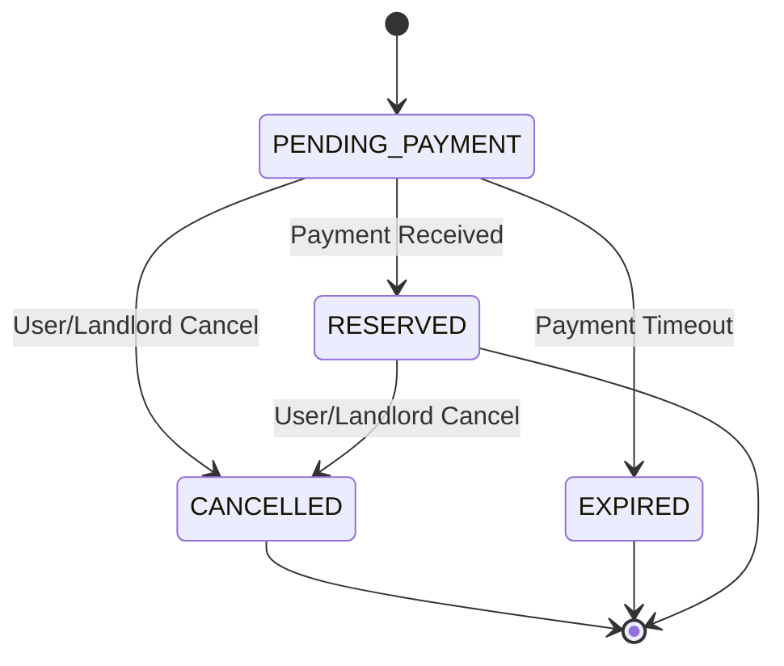

# Reservation Process Design

## Overview

The reservation process in BoardTAU is a multi-step workflow that allows potential tenants to reserve rooms in boarding houses after their inquiries have been approved by landlords. This document outlines the design of the reservation process, including payment integration and status management.

## Current Implementation

Currently, the system has a basic reservation process implemented through the `/api/reservations/direct` endpoint, which creates a reservation directly without an inquiry step. The status management is minimal, and there's no payment integration.

## Issues with Current Design

1. **Inquiry Integration**: Reservations are created directly without prior inquiry approval
2. **Payment System**: No integration with payment gateways (GCash, Maya, Stripe)
3. **Status Management**: Limited reservation statuses and lack of status transitions
4. **User Experience**: No clear feedback or tracking for the reservation process

## Redesign Goals

1. **Inquiry First**: Ensure reservations are only created after inquiry approval
2. **Payment Integration**: Implement GCash, Maya (PayMongo), and Stripe payments
3. **Status Management**: Create comprehensive reservation statuses and transitions
4. **User Experience**: Provide clear feedback and tracking for the reservation process
5. **Security**: Ensure secure payment processing and data handling

## New Reservation Process Design

### Process Flow
```
┌───────────────────────────────────────────────────┐
│  1. Inquiry Sent → 2. Inquiry Approved →          │
│  3. Reservation Created → 4. Payment Due →         │
│  5. Payment Received → 6. Reservation Reserved    │
└───────────────────────────────────────────────────┘
```

### Detailed Process Steps

#### Step 1: Inquiry Sent
- **User Action**: Submits inquiry through InquiryModal
- **System Action**: Creates an inquiry record with status "PENDING"
- **Notification**: Landlord receives email notification
- **API Endpoint**: `/api/inquiries` (POST)
- **Stored in**: My Inquiries page

#### Step 2: Inquiry Approved
- **Landlord Action**: Reviews and approves inquiry from dashboard
- **System Action**: Creates reservation record with status "PENDING_PAYMENT"
- **Notification**: User receives email with payment link
- **API Endpoint**: `/api/inquiries` (PUT)
- **Moved to**: My Reservations page

#### Step 3: Payment Due
- **User Action**: Clicks payment link from email or views reservation in dashboard
- **System Action**: Displays payment options (GCash, Maya, Stripe)
- **API Endpoint**: `/api/reservations/[id]/payment-options` (GET)

#### Step 4: Payment Received
- **User Action**: Completes payment through selected gateway
- **System Action**: Verifies payment, updates reservation status to "RESERVED"
- **Notification**: Landlord receives payment confirmation email
- **API Endpoint**: `/api/reservations/[id]/payment` (POST)

#### Step 5: Reservation Reserved
- **Status**: Reservation is now reserved for the user
- **Duration**: Until agreed move-in date
- **Action**: User can now prepare for move-in

## Payment Integration

### Supported Payment Methods
1. **GCash**: Through PayMongo integration
2. **Maya (formerly PayMaya)**: Through PayMongo integration
3. **Stripe**: Direct Stripe API integration for card payments

### Payment Flow
```
┌───────────────────────────────────────────────────┐
│  Select Payment Method → Payment Gateway →        │
│  Payment Processing → Payment Confirmation        │
└───────────────────────────────────────────────────┘
```

### Payment Gateway Integration
- **PayMongo**: Handles GCash and Maya payments
- **Stripe**: Handles card payments

### Payment Security
- **PCI DSS Compliance**: For card payments
- **Encryption**: All sensitive data is encrypted
- **Tokenization**: No payment details stored on servers
- **Fraud Detection**: Integration with payment gateway fraud detection

## Reservation Statuses

### Reservation Status List
| Status | Description |
|--------|-------------|
| PENDING_PAYMENT | Reservation created but payment not yet made |
| RESERVED | Payment received, reservation confirmed |
| CANCELLED | Reservation cancelled by user or landlord |
| EXPIRED | Payment not made within specified timeframe |

### Status Transitions


## Reservation Dashboard

### User Dashboard
- **Reservations Overview**: List of all reservations with status
- **Payment Tracking**: Link to payment portal for pending payments
- **Check-in/Check-out Dates**: Display of key dates
- **Contact Landlord**: Direct messaging or call option
- **Cancel Reservation**: Option to cancel pending reservations

### Landlord Dashboard
- **Reservation Management**: List of all reservations with status
- **Check-in/Check-out**: Buttons to confirm check-in/check-out
- **Payment Tracking**: Payment status and history
- **Tenant Information**: Details about the tenant

## Implementation Details

### API Endpoints
```typescript
// Get reservation by ID
GET /api/reservations/[id]

// Get payment options
GET /api/reservations/[id]/payment-options

// Process payment
POST /api/reservations/[id]/payment

// Check-in
PUT /api/reservations/[id]/check-in

// Check-out
PUT /api/reservations/[id]/check-out

// Complete reservation
PUT /api/reservations/[id]/complete

// Cancel reservation
PUT /api/reservations/[id]/cancel
```

### Database Schema
```typescript
interface Reservation {
  id: string;
  inquiryId: string;
  roomId: string;
  userId: string;
  landlordId: string;
  listingId: string;
  startDate: Date;
  endDate: Date;
  duration: number; // in months
  price: number;
  totalAmount: number;
  status: 'PENDING_PAYMENT' | 'CONFIRMED' | 'CHECKED_IN' | 'CHECKED_OUT' | 'COMPLETED' | 'CANCELLED' | 'EXPIRED';
  paymentStatus: 'UNPAID' | 'PAID' | 'REFUNDED';
  paymentMethod?: 'GCASH' | 'MAYA' | 'STRIPE' | 'CASH';
  paymentReference?: string;
  createdAt: Date;
  updatedAt: Date;
}
```

## Benefits of the Redesign

1. **Inquiry First Approach**: Ensures landlord approval before reservation
2. **Comprehensive Payment Options**: Supports GCash, Maya, and Stripe
3. **Clear Status Management**: Detailed reservation statuses and transitions
4. **Enhanced User Experience**: Better feedback and tracking for both users and landlords
5. **Security**: Secure payment processing and data handling
6. **Scalability**: Flexible design to support future payment methods

## File Structure

```
src/
├── api/
│   └── reservations/
│       ├── [id]/
│       │   ├── route.ts
│       │   ├── payment-options/
│       │   │   └── route.ts
│       │   ├── payment/
│       │   │   └── route.ts
│       │   ├── check-in/
│       │   │   └── route.ts
│       │   ├── check-out/
│       │   │   └── route.ts
│       │   ├── complete/
│       │   │   └── route.ts
│       │   └── cancel/
│       │       └── route.ts
│       └── route.ts
├── components/
│   ├── payment/
│   │   ├── PaymentOptions.tsx
│   │   ├── PaymentProcessing.tsx
│   │   └── PaymentSuccess.tsx
│   └── reservations/
│       ├── ReservationCard.tsx
│       └── ReservationDetails.tsx
├── services/
│   └── payment/
│       ├── paymongo.ts
│       ├── stripe.ts
│       └── index.ts
└── docs/
    └── reservation/
        └── reservation-process-design.md (this file)
```

## Related Documentation

- [PRD.md](../features/PRD.md) - Product Requirements Document
- [TASK-ANALYSIS.md](../reference/TASK-ANALYSIS.md) - Task Analysis Forms
- [INPUT-PROCESS-OUTPUT-DOCUMENTATION.md](../reference/INPUT-PROCESS-OUTPUT-DOCUMENTATION.md) - Input Process Output Documentation
- [room-section-redesign.md](room-section-redesign.md) - Room Section Redesign
- [inquiry-form-design.md](inquiry-form-design.md) - Inquiry Form Design
- [rooms-modal-design.md](rooms-modal-design.md) - Rooms Modal Design

## Next Steps

1. Review and approve this reservation process design
2. Implement the new API endpoints
3. Create payment integration services
4. Update the database schema
5. Develop reservation management components
6. Test the reservation process with various scenarios
7. Gather user feedback and make improvements
8. Document the final implementation
