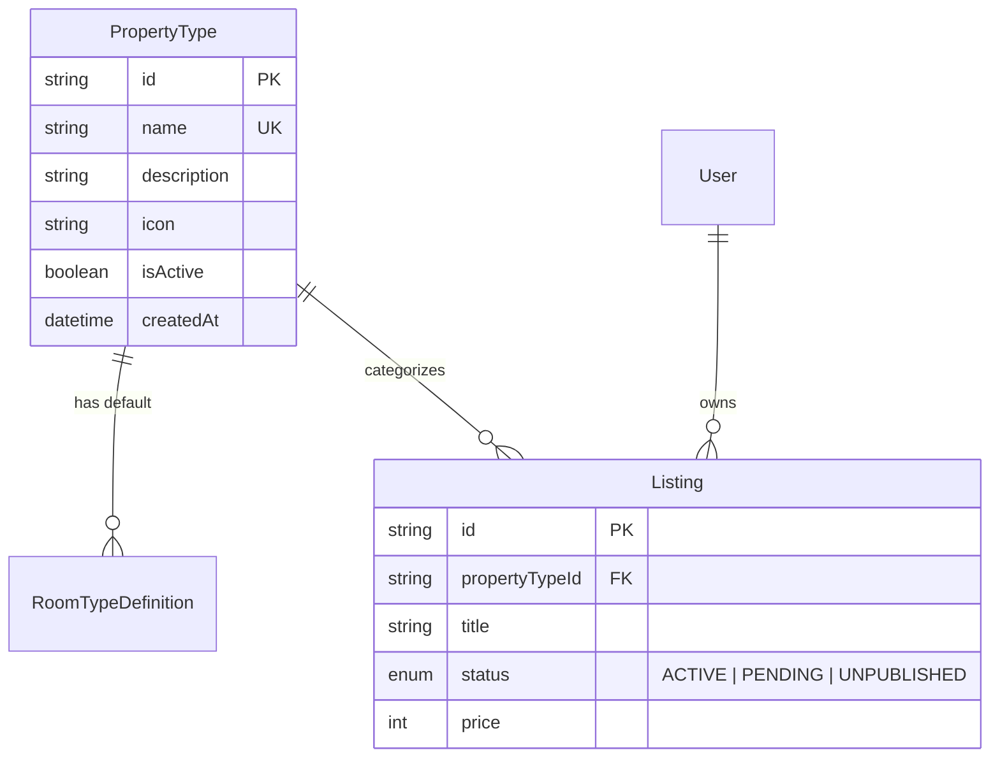
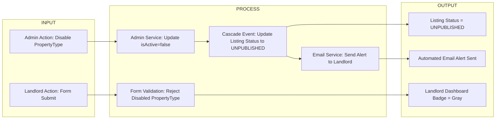

# Admin & Database Refactor Plan: Dynamic Property Types

## 1. Rationale & Architectural Goal
Currently, Property Types (formerly Categories) are stored as a hardcoded array of strings in `utils/constants.ts` and `data/categories.ts`, as well as a string array (`category String[]`) on the `Listing` model in `schema.prisma`.

**Why we are changing this:**
1. **Super Admin Autonomy:** Super Admins must be able to add new Property Types (e.g. "Agri-Hostel", "Transient House") directly from the Admin Dashboard without developer intervention.
2. **Data Integrity & Scalability:** Storing property types as loose string arrays leads to typos and database pollution. Replacing `category String[]` with a relational `PropertyType` model ensures strict data integrity.
3. **Self-Healing Fallback (`UNPUBLISHED` Flow):** When an admin deactivates a Property Type, attached listings must not crash or vanish mysteriously. They will automatically transition to an `UNPUBLISHED` status, notifying the landlord to update their property category.

---

## 2. Do's and Don'ts (Strict Guardrails)

### Do's:
- **DO** use the `@tanstack/react-table` pattern (matching User Directory) for the new Admin Property Configuration UI (`/admin/settings/property-configuration`).
- **DO** implement a "Soft Delete" (`status: UNPUBLISHED`) flow instead of hard-deleting Property Types from the database.
- **DO** reuse the `CustomAmenityModal.tsx` icon search grid pattern for picking Lucide icons in the admin modal.
- **DO** update all Prisma queries and MongoDB aggregation pipelines to filter by `propertyTypeId` instead of string array matching.
- **DO** send an email notification (`services/email/notifications.ts`) to affected landlords when their Property Type is disabled.

### Don'ts (DO NOT TOUCH):
- **DO NOT** invent custom UI components or change the color palette. All admin pages MUST inherit BoardTAU's existing Tailwind + Framer-Motion glassmorphic design system.
- **DO NOT** hard-delete a `PropertyType` if active listings are attached to it.
- **DO NOT** allow landlords to save a listing if its selected Property Type is currently `isActive: false`.
- **DO NOT** modify authentication, user roles, or tenant search modal layout beyond updating data sources.

---

## 3. OWASP Security & Vulnerability Mitigation Matrix

| OWASP Vulnerability | Risk / Attack Vector | Engineering Mitigation |
| :--- | :--- | :--- |
| **A01:2021 - Broken Access Control** | Non-admin user calls `/api/admin/property-types` directly to create/delete property types. | Enforce strict NextAuth session role check (`req.user.role === 'SUPER_ADMIN'`) on all admin API routes. Reject unauthenticated requests with HTTP 403 Forbidden. |
| **A03:2021 - Mass Assignment / Injection** | Attacker injects extra JSON fields (e.g. `isSuperAdmin: true`) into property type creation requests. | Validate input payload strictly using Zod (`z.object({ name: z.string().min(2), icon: z.string() }).strict()`). Extra fields are automatically rejected. |
| **A04:2021 - Insecure Design (Cascading State)** | Deactivating a Property Type leaves attached listings in an orphaned broken state. | Implement automated database transaction to cascade listing status to `UNPUBLISHED` and log an audit trail event. |

---

## 4. UI/UX Consistency Standards
- **Icons:** Use `lucide-react` string names (e.g. `"Building"`, `"Home"`, `"Sprout"`).
- **Admin Layout:** Place inside `Admin Panel -> General Settings -> Property Configuration`.
- **Table Controls:** Inherit standard `@tanstack/react-table` sorting, search bar, pagination, and `CellAction` dropdown menu (`Edit`, `Disable`, `Manage Room Types`).
- **Modals:** Use standard BoardTAU modal styling with Framer-Motion enter/exit animations.

## 4. Architectural Diagrams

### A. Entity Relationship Diagram (ERD)


### B. Input-Process-Output (IPO) Architecture


---

## 5. Database Schema Changes (`schema.prisma`)

```prisma
enum ListingStatus {
  ACTIVE
  PENDING
  APPROVED
  REJECTED
  UNPUBLISHED
  FLAGGED
}

model PropertyType {
  id          String   @id @default(auto()) @map("_id") @db.ObjectId
  name        String   @unique // e.g., "Apartment", "Boarding House"
  description String?  // Consumed by tooltips / admin cards
  icon        String?  // Lucide icon identifier string
  isActive    Boolean  @default(true)
  createdAt   DateTime @default(now())
  updatedAt   DateTime @updatedAt

  roomTypes   RoomTypeDefinition[]
  listings    Listing[]
}
```

### Changes to `Listing` Model
- Replace `category String[]` with `propertyTypeId String @db.ObjectId`.
- Add relation `propertyType PropertyType @relation(fields: [propertyTypeId], references: [id])`.
- Change `status String` to `status ListingStatus`.

---

## 5. Backend Services & Query Updates

### Search Engine (`services/listing/search.service.ts`)
- Update `aggregateRaw` pipeline. Change `baseMatch.category = { $in: [...] }` to `baseMatch.propertyTypeId = { $in: [...] }`.

### Tenant APIs (`services/user/listings/index.ts`)
- Update Prisma `where` clauses from `category: { hasSome: [...] }` to `propertyTypeId: { in: [...] }` and `status: 'ACTIVE'`.

### Admin APIs (`services/admin/*`)
- `listings.ts`, `inquiries.ts`, `dashboard.ts`: Update `.findMany()` and `.findUnique()` queries to `include: { propertyType: true }`.

### Landlord APIs (`services/landlord/properties.ts`)
- Accept single `propertyTypeId` string on creation/update. Include `propertyType` in return payloads.

### Email Service (`services/email/notifications.ts`)
- Implement `sendPropertyTypeDisabledEmail` function to alert landlords when their property type is deactivated.

---

## 6. Super Admin & Self-Healing Fallback Flow

### Super Admin Management Page (`/admin/settings/property-configuration`)
- Built using `@tanstack/react-table`.
- **Columns:** Icon Preview, Label, Status (`Active` / `Disabled`), Created At, Actions.
- **Action Menu:** `Edit`, `Disable`, **"Manage Room Types"** (opens nested modal).

### The "UNPUBLISHED" Fallback Flow
1. **Admin Action:** Admin sets `isActive = false` on a Property Type (e.g. "Glamping Tent").
2. **Backend Action:** System updates all attached listings to `status = 'UNPUBLISHED'` and sends automated email.
3. **Landlord View:** Listing displays a gray "Unpublished" badge.
4. **Landlord Resolution:** Form forces landlord to select an active, valid Property Type from the dropdown before saving.

---

## 7. File Modifications List

### [DELETE] Files to Delete
- Remove `categories` array in `utils/constants.ts`.

### [NEW] Files to Create
- `app/admin/features/property-configuration/index.tsx`
- `app/admin/features/property-configuration/components/property-tables/index.tsx`
- `app/admin/features/property-configuration/components/property-tables/columns.tsx`
- `app/admin/features/property-configuration/components/property-tables/cell-action.tsx`
- `app/admin/features/property-configuration/components/modals/add-property-type-modal.tsx`

### [MODIFY] Files to Update
- `prisma/schema.prisma`
- `services/listing/search.service.ts`
- `services/user/listings/index.ts`
- `services/landlord/properties.ts`
- `services/admin/listings.ts`
- `services/email/notifications.ts`
- `app/landlord/features/property-management/index.tsx`
- `app/landlord/features/property-management/components/creator/PropertyBasicStep.tsx`
- `app/admin/features/settings/components/general/index.tsx`
- `app/admin/features/moderation/components/listings-review/*` (`admin-listing-card.tsx`, `admin-listing-review-modal.tsx`, `index.tsx`)

---

## 8. Verification Plan
1. Run `npx prisma generate` and `seed.ts`.
2. Access `/admin/settings/property-configuration` and verify Property Types data table loads cleanly.
3. Deactivate a Property Type and verify attached listings transition to `UNPUBLISHED`.
4. Verify Landlord receives email notification and cannot resubmit until selecting an active Property Type.
