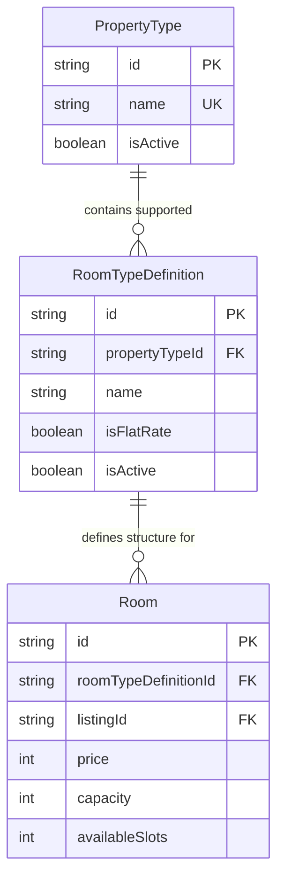
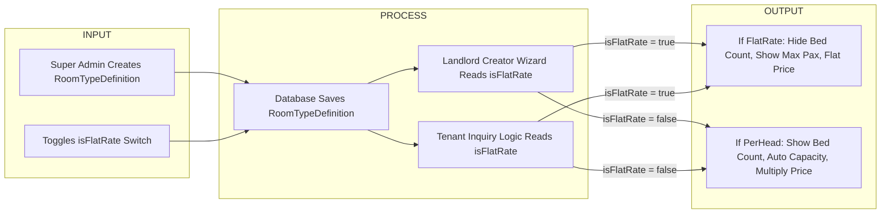

# Super Admin: Dynamic Room Types Refactor Plan

## 1. Rationale & Architectural Goal
Transition Room Types from a static Prisma `enum` into a dynamic database model (`RoomTypeDefinition`) managed by Super Admins inside the Admin Dashboard.

**Why we are changing this:**
1. **Nested Hierarchy:** Room Types belong to a specific Property Type (e.g. "Studio Unit" belongs to "Apartment", whereas "Bedspace" belongs to "Boarding House").
2. **Master-Detail Admin UI:** Super Admins need a clean, non-cluttered way to manage Room Types directly within the context of a Property Type.
3. **Logic Driver (`isFlatRate`):** The Super Admin sets the `isFlatRate` boolean when creating a Room Type, which automatically dictates how the entire system calculates prices and renders forms.

---

## 2. Do's and Don'ts (Strict Guardrails)

### Do's:
- **DO** use a Master-Detail (Nested Modal) UI pattern for managing Room Types: clicking "Manage Room Types" on a Property Type row opens a nested slide-over/modal (`ManageRoomTypesModal.tsx`).
- **DO** include the `isFlatRate` toggle switch in the Room Type creation form so Super Admins dictate pricing behavior.
- **DO** reuse the Lucide icon picker pattern matching `CustomAmenityModal.tsx`.
- **DO** soft-delete Room Types (`isActive: false`) to preserve historical landlord listing data.

### Don'ts (DO NOT TOUCH):
- **DO NOT** create a separate, unlinked page for Room Types; keep them cleanly nested under Property Types to prevent admin confusion.
- **DO NOT** hard-delete Room Types if listings or rooms currently link to them.
- **DO NOT** invent new modal styling; inherit BoardTAU's existing `Modal.tsx` and Framer-Motion transition components.

---

## 3. OWASP Security & Vulnerability Mitigation Matrix

| OWASP Vulnerability | Risk / Attack Vector | Engineering Mitigation |
| :--- | :--- | :--- |
| **A01:2021 - Broken Access Control** | Landlord or tenant calls `/api/admin/room-types` to modify system room definitions. | Enforce NextAuth session role check (`req.user.role === 'SUPER_ADMIN'`) on all creation, update, and deletion endpoints. |
| **A03:2021 - Parameter Injection** | Attacker tampers with `propertyTypeId` foreign key to link room types to non-existent or invalid property types. | Validate foreign key existence in database (`prisma.propertyType.findUnique`) before creating `RoomTypeDefinition`. |
| **A04:2021 - Insecure Design (Pricing Tampering)** | Landlord client payload attempts to set `isFlatRate: true` on per-head bedspaces to bypass pricing rules. | Re-validate `isFlatRate` flag server-side against the database `RoomTypeDefinition` record during room creation/update. |

---

## 4. UI/UX Consistency Standards
- **Master-Detail Modal:** Uses glassmorphic backdrop (`bg-black/60 backdrop-blur-sm`) and sliding panel transitions matching BoardTAU modals.
- **Icon Selector:** Grid layout with search input filtering `lucide-react` icons.
- **Table Controls:** Data table inside modal uses mini `@tanstack/react-table` formatting with status badges (`Active` / `Disabled`).

## 4. Architectural Diagrams

### A. Entity Relationship Diagram (ERD)


### B. Input-Process-Output (IPO) Architecture


---

## 5. Proposed Database Schema Changes (`schema.prisma`)

```prisma
model RoomTypeDefinition {
  id             String       @id @default(auto()) @map("_id") @db.ObjectId
  propertyTypeId String       @db.ObjectId
  name           String       // e.g., "Studio Unit", "Bedspace"
  description    String?      // Consumed by tooltips
  icon           String?      // Lucide icon identifier
  isFlatRate     Boolean      @default(false)
  isActive       Boolean      @default(true)
  createdAt      DateTime     @default(now())
  updatedAt      DateTime     @updatedAt

  propertyType   PropertyType @relation(fields: [propertyTypeId], references: [id], onDelete: Cascade)
  rooms          Room[]
}
```

---

## 5. File Modifications List

### [DELETE] Files to Delete
- `data/roomTypes.ts`

### [NEW] Files to Create
- `app/admin/features/property-configuration/components/modals/manage-room-types-modal.tsx`
- `app/admin/features/property-configuration/components/modals/add-room-type-modal.tsx`

### [MODIFY] Files to Update
- `prisma/schema.prisma`
- `services/admin/listings.ts`
- `services/landlord/rooms.ts`
- `app/admin/features/property-configuration/components/property-tables/cell-action.tsx` (Add "Manage Room Types" action button)

---

## 6. Verification Plan
1. In `/admin/settings/property-configuration`, click "Manage Room Types" on the "Apartment" row.
2. Verify the nested modal opens cleanly and displays existing Apartment room types.
3. Add a new Room Type "Penthouse Suite", toggle `isFlatRate = true`, and click Save.
4. Verify Landlord wizard instantly reflects "Penthouse Suite" under Apartment listings.
