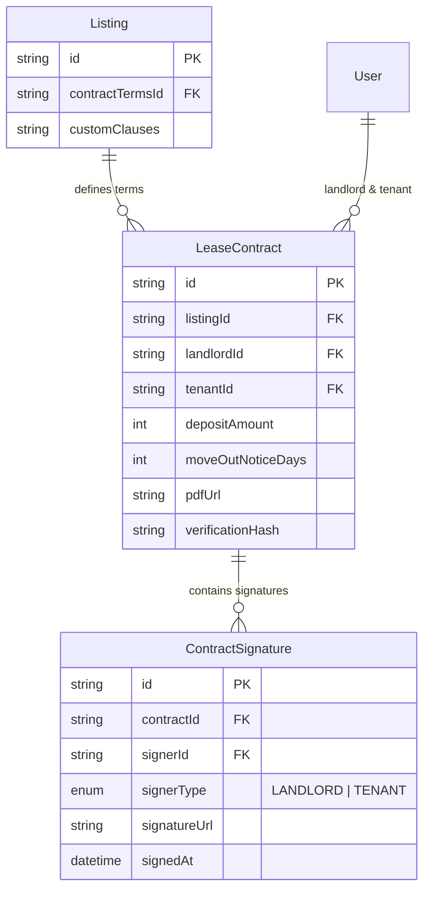
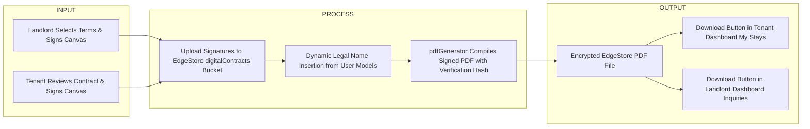

# Digital Lease Agreement & Signature Security Plan

## 1. Rationale & Architectural Goal
Currently, lease agreements and house policies are communicated informally via chat or un-formatted notes.

**Why we are building this:**
1. **Automated Contract Generation:** Landlords click simple setup buttons in the wizard $\rightarrow$ system automatically compiles a beautifully formatted, legal-looking contract PDF using BoardTAU's existing `pdfGenerator.ts` architecture.
2. **Custom Clauses Flexibility:** Landlords can add custom clause items (e.g. *"Sub-meter electric bill must be paid on or before the 5th of each month"*), which are appended as numbered clauses in the contract.
3. **Dynamic Legal Names:** Legal names, emails, and verification badges are dynamically populated from authenticated database profiles (`User.name`, `User.email`, `User.role`).
4. **Signature Security & Data Privacy:** Digital signature images drawn on `SignaturePad.tsx` and generated contract PDFs are sensitive PII (Personally Identifiable Information). They will be stored in EdgeStore under a dedicated `digitalContracts` bucket with strict access control (restricted strictly to the Tenant, Landlord, and Super Admin).

---

## 2. Do's and Don'ts (Strict Guardrails)

### Do's:
- **DO** populate landlord and tenant legal names dynamically from `User` database models. Never hardcode names.
- **DO** store signature images and signed PDFs inside EdgeStore's protected `digitalContracts` bucket.
- **DO** enforce strict `accessControl` on `digitalContracts`: ONLY the specific Tenant (`owner`), the specific Landlord (`landlord`), and `ADMIN` / `SUPER_ADMIN` have read/download permission.
- **DO** reuse BoardTAU's existing `pdfGenerator.ts` styling (`#2f7d6d` primary color, header branding, audit report ID, timestamp).
- **DO** generate a unique cryptographic verification hash (e.g. `BTAU-CONTRACT-2026-XXXXXX`) stamped on the contract for legal proof of authenticity.

### Don'ts (DO NOT TOUCH):
- **DO NOT** store signature images in public EdgeStore buckets (`publicFiles`).
- **DO NOT** allow unauthenticated users or outside third parties to access contract PDFs or signature URLs.
- **DO NOT** force landlords to write manual legal boilerplate; generate standard legal clauses automatically from their button selections.

---

## 3. OWASP Security & Data Privacy Vulnerability Matrix

| OWASP Vulnerability | Risk / Attack Vector | Engineering Mitigation |
| :--- | :--- | :--- |
| **A01:2021 - Insecure Direct Object Reference (IDOR)** | Attacker guesses PDF URL or signature image URL (e.g. `/files/contract-123.pdf`) to read other users' private legal contracts. | Enforce EdgeStore `accessControl` restricting read access strictly to `{ userId: { path: "owner" } }`, `{ userId: { path: "landlord" } }`, and `{ role: { eq: "ADMIN" } }`. Unauthenticated / Unauthorized requests receive HTTP 403. |
| **A03:2021 - Signature Canvas Tampering / Data Bombing** | Attacker uploads oversized binary blobs or malicious scripts inside the base64 signature string (`SignaturePad.tsx`). | Validate base64 signature image size (max 500KB) and enforce MIME type restriction (`image/png` / `image/jpeg`). |
| **A07:2021 - Identification & Authentication Failures** | Unauthorized user signs contract impersonating another tenant. | Require active authenticated session + OTP verification (Step 7 of `InquiryModal.tsx`) before accepting signature submission. |

---

## 4. EdgeStore Security & Bucket Configuration (`lib/edgestore-router.ts`)

```typescript
// New Protected Bucket for Digital Signatures & Signed Lease Contracts
digitalContracts: es
  .fileBucket({
    maxSize: 1024 * 1024 * 15,
    accept: ["image/png", "image/jpeg", "application/pdf"],
  })
  .input(
    z.object({
      listingId: z.string(),
      landlordId: z.string(),
    })
  )
  .path(({ ctx, input }) => [{ owner: ctx.userId }, { landlord: input.landlordId }])
  .metadata(({ ctx, input }) => ({
    userId: ctx.userId,
    listingId: input.listingId,
    landlordId: input.landlordId,
  }))
  .beforeUpload(({ ctx }) => {
    const allowedRoles = ["USER", "LANDLORD", "ADMIN", "SUPER_ADMIN"];
    return ctx.userId !== "unauthenticated" && allowedRoles.includes(ctx.role);
  })
  .accessControl({
    OR: [
      { role: { eq: "ADMIN" } },
      { role: { eq: "SUPER_ADMIN" } },
      { userId: { path: "landlord" } },
      { userId: { path: "owner" } },
    ],
  }),
```

---

## 4. Architectural Diagrams

### A. Entity Relationship Diagram (ERD)


### B. Input-Process-Output (IPO) Architecture


---

## 5. End-to-End User Journey Flow

### Phase 1: Landlord Setup (`PropertyConfigStep.tsx`)
1. Landlord configures contract terms via simple buttons:
   - Security Deposit (`1 Month`, `2 Months`, `None`).
   - Move-Out Notice (`15 Days`, `30 Days`).
   - Maintenance Clause (*Standard reimbursement clause*).
2. Landlord adds custom rules in **"Additional Contract Clauses"** (e.g. *"Sub-meter electric bill must be paid by the 5th of each month"*).
3. Landlord draws signature on `SignaturePad.tsx`. Uploaded securely to `digitalContracts` bucket.

### Phase 2: Tenant Review & E-Signing (`InquiryModal.tsx` -> Step 8)
1. Tenant reaches Step 8 of Inquiry Modal.
2. Tenant reviews the auto-generated **Digital Lease Agreement Card** displaying dynamic legal names (*Juan Dela Cruz* $\leftrightarrow$ *Maria Santos*), property details, rent/deposit terms, and custom clauses.
3. Tenant draws signature on `SignaturePad.tsx` and checks *"I agree to the Landlord's Lease Terms."*
4. Signature uploaded to `digitalContracts` bucket.

### Phase 4: Admin Listing Moderation & Governance (`admin-listing-review-modal.tsx`)
1. Before a Super Admin or System Admin approves a pending listing (turning it `ACTIVE`), they review the listing in `Admin Panel -> Moderation Queue`.
2. **Section 07: Lease Agreement & Signature Audit** added to `admin-listing-review-modal.tsx`:
   - Admin reviews the Landlord's default security deposit terms, advance rent requirements, move-out notice period, and custom clauses.
   - Admin inspects the Landlord's **E-Signature Image** (`digitalContracts` bucket).
   - If the contract terms or signature are predatory or invalid, the admin rejects the listing with a custom reason.
   - If approved, the listing becomes `ACTIVE` and ready for tenant inquiry/reservation.

---

## 6. File Modifications List

### [NEW] Files to Create
- `components/common/SignaturePad.tsx` (Interactive HTML5 Canvas drawing component with clear/undo/type fallback)
- `utils/contractPdfGenerator.ts` (Auto-generates official BoardTAU Lease Contract PDFs)

### [MODIFY] Files to Update
- `lib/edgestore-router.ts` (Add protected `digitalContracts` bucket with strict access control)
- `prisma/schema.prisma` (Add `LeaseContract` and `ContractSignature` models)
- `app/landlord/features/property-management/components/creator/PropertyConfigStep.tsx` (Add Contract Terms setup & Landlord SignaturePad)
- `components/modals/InquiryModal.tsx` & `ReviewStep.tsx` (Add Lease Contract review & Tenant SignaturePad)
- `app/admin/features/moderation/components/listings-review/admin-listing-review-modal.tsx` (Add Admin Lease Agreement & Signature Audit Section)
- `app/admin/features/moderation/components/listings-review/admin-listing-card.tsx` (Add Lease Contract status badge indicator)
- `components/reservations/ReservationDetailsModal.tsx` & `ReservationCard.tsx` (Tenant Contract Download Button)
- `components/inquiries/InquiryDetailsModal.tsx` & `InquiryCard.tsx` (Tenant Contract Preview Button)
- `app/landlord/features/booking-reservations/components/landlord-reservation-details-modal.tsx` & `landlord-reservation-card.tsx` (Landlord Contract Download Button)
- `app/landlord/features/inquiry-center/components/landlord-inquiry-details-modal.tsx` & `landlord-inquiry-card.tsx` (Landlord Contract Review Button)
- `services/landlord/properties.ts` & `services/user/listings/index.ts` (Handle contract generation & signature links)

---

## 7. Verification Plan
1. Landlord creates listing, selects 30-day notice + 1 month deposit, adds custom clause *"Electric bill due on 5th"*, and draws signature.
2. Verify signature uploads to `digitalContracts` bucket.
3. Tenant opens `InquiryModal.tsx`, reaches Step 8, reviews contract with dynamic legal names, draws signature, and submits.
4. Verify PDF is generated with `BTAU-CONTRACT-HASH` stamp.
5. Log in as an unauthorized third party $\rightarrow$ verify EdgeStore denies access to signature and contract URLs. Log in as Tenant or Landlord $\rightarrow$ verify download succeeds.
