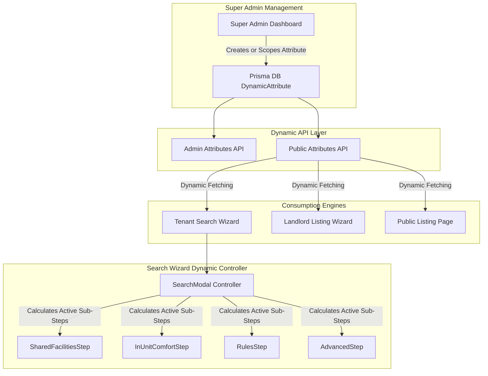
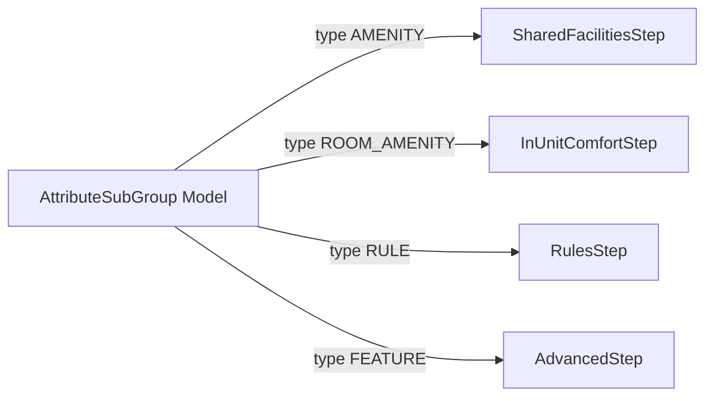
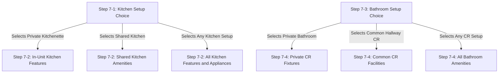
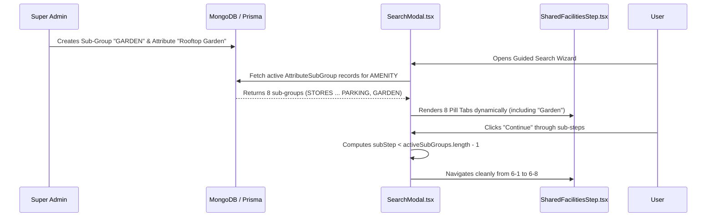
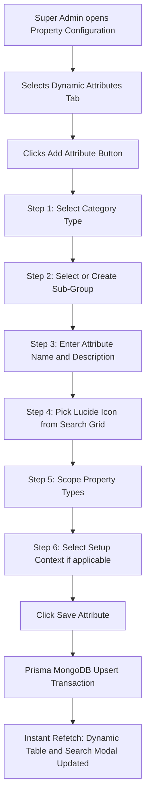
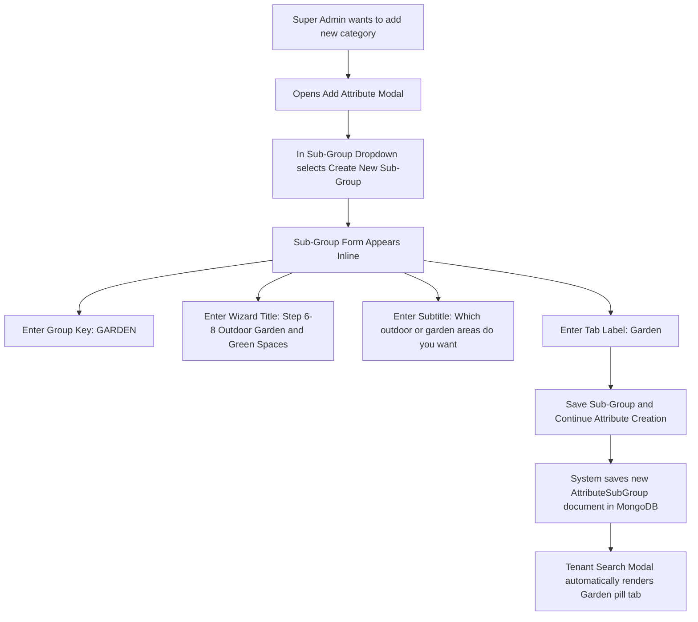
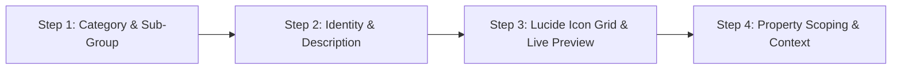
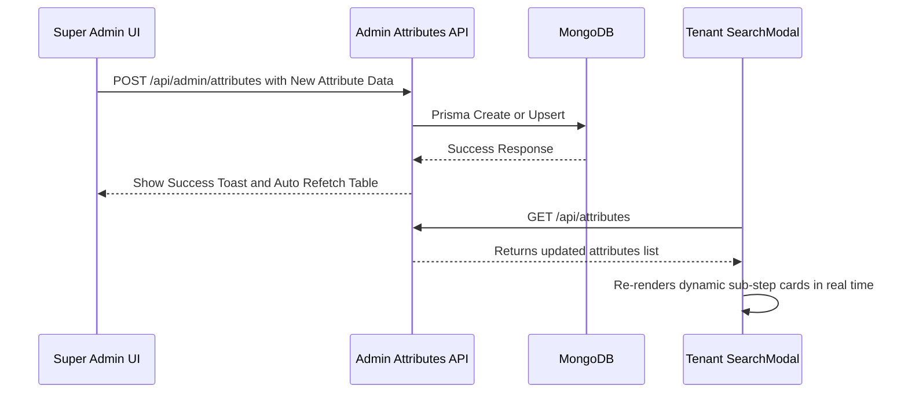

# Stage 2: Dynamic Taxonomy & Cascading Architecture Plan

## 📌 Executive Summary & Architectural Vision

In **Stage 1**, we successfully modernized the Super Admin **Property Configuration** UI/UX with standardized metrics, responsive light/dark modes, Lucide icon selectors, property-type scoping checkboxes, and real-time pagination.

In **Stage 2**, we are building the core engine: **Dynamic Taxonomy Cascading**.
When a Super Admin creates, edits, or scopes a property category, room type, or dynamic attribute (Amenity, Room Amenity, Rule, Feature), the system must **automatically cascade and group that item into**:
1. **Tenant Search Wizard** (`SearchModal.tsx` & sub-step components)
2. **Landlord Listing Creation Wizard** (Property & Room setup steps)
3. **Property Listing Details Page** (Dynamic badge grids)

---

## 📐 System Architecture & Data Flow



---

## 🗄️ Database Schema Blueprint: Dynamic Sub-Group System

To prevent future hardcoding bottlenecks and allow Super Admins to create **brand new sub-step groups on the fly** (e.g. creating a new *"Garden & Green Spaces"* sub-step group in the future without code changes), we introduce the **`AttributeSubGroup`** model:

```prisma
enum AttributeType {
  AMENITY      // Shared Property Facility (Onsite/Common)
  ROOM_AMENITY // In-Unit / Room Feature
  RULE         // House Rules & Conduct Policies
  FEATURE      // Security & Infrastructure Features
}

// 1. Dynamic Sub-Group Definition Model (Super Admin Managed)
model AttributeSubGroup {
  id                String        @id @default(auto()) @map("_id") @db.ObjectId
  type              AttributeType // AMENITY, ROOM_AMENITY, RULE, or FEATURE
  key               String        @unique // e.g. "STORES", "WIFI", "GARDEN"
  title             String        // e.g. "Step 6-8: Outdoor, Garden & Green Spaces"
  subtitle          String        // e.g. "Which outdoor or garden facilities do you want?"
  tabLabel          String        // e.g. "Garden" (renders on breadcrumb pill)
  displayOrder      Int           @default(0)
  isActive          Boolean       @default(true)
  createdAt         DateTime      @default(now())
  updatedAt         DateTime      @updatedAt
}

// 2. Dynamic Attribute Model
model DynamicAttribute {
  id                String        @id @default(auto()) @map("_id") @db.ObjectId
  type              AttributeType
  subGroupKey       String?       // Foreign key reference to AttributeSubGroup.key
  name              String        @unique
  icon              String?       // Lucide icon name (e.g. "Wifi", "Zap", "Trees")
  description       String?       // Consumed by HelpTooltip.tsx
  isActive          Boolean       @default(true)
  isUniversal       Boolean       @default(true) // Applies to all property types if true
  propertyTypeNames String[]      // e.g. ["Boarding House", "Dormitory"]
  createdAt         DateTime      @default(now())
  updatedAt         DateTime      @updatedAt
}
```

## 🗺️ Unified Sub-Group Matrix Across All 4 Search Wizard Steps

The `AttributeSubGroup` engine powers **all 4 attribute-driven steps** in the Search Modal:



### 1. Shared Facilities (`type: AMENITY`) — `SharedFacilitiesStep.tsx`
- **Baseline Sub-Groups**: `STORES`, `WIFI`, `POWER_WATER`, `LAUNDRY`, `STUDY_LOUNGE`, `CARETAKER`, `PARKING`
- **Unlimited Custom Examples**: `GARDEN`, `SPORTS`, `PET_ZONE`, `ROOFTOP`, `COMMUNITY_CENTER`, etc.

### 2. In-Unit Comfort (`type: ROOM_AMENITY`) — `InUnitComfortStep.tsx`

`InUnitComfortStep.tsx` features **Smart Conditional Branching** based on the tenant's choice in Step 7-1 (Kitchen Setup) and Step 7-3 (Bathroom Setup):



#### **Setup Context Attribute Tagging (`setupContext`)**:
For `ROOM_AMENITY` attributes, we include a `setupContext` tag (`IN_UNIT` | `SHARED` | `PRIVATE` | `COMMON_CR` | `UNIVERSAL`):

| Sub-Group Key | `setupContext` | Example Seed Attributes | Dynamic Rendering Trigger |
| :--- | :--- | :--- | :--- |
| `KITCHEN_APP` | `IN_UNIT` | Kitchen Sink, Cooking Stove, Personal Fridge, Personal Microwave, Kettle, Rice Cooker | Rendered when tenant picks **Private Kitchenette** |
| `KITCHEN_APP` | `SHARED` | Shared Cooking Stove, Shared Refrigerator, Shared Microwave, Shared Kettle | Rendered when tenant picks **Shared Common Kitchen** |
| `BATHROOM_FIX` | `PRIVATE` | Hot & Cold Shower Heater, Bidet, Exhaust Fan, Toilet Flush, Water Drum (Tabo) | Rendered when tenant picks **Private CR Inside Room** |
| `BATHROOM_FIX` | `COMMON_CR` | Shared Shower Heater, Shared Bidet, Common Exhaust Fan, Water Storage Drum | Rendered when tenant picks **Common Hallway CR** |
| `COOLING` | `UNIVERSAL` | Inverter AC, Window AC, Split AC, Ceiling Fan, Stand Fan | Rendered in Step 7-5 |
| `FURNITURE` | `UNIVERSAL` | Study Desk, Ergonomic Chair, Lockable Closet, Foam Mattress, Sofa, TV | Rendered in Step 7-6 |
| `GARDEN` | `IN_UNIT` | Private Balcony, Private Veranda / Terrace, Private Roof Deck, Private Garden / Yard | Rendered in Outdoor Amenities step |

#### **Property-Type Scoping & Branch Scoping Rules (`propertyTypeNames`)**:
Attributes can be scoped to specific property types using `isUniversal` and `propertyTypeNames`:

```mermaid
graph LR
    A["DynamicAttribute in DB"] -->|isUniversal: true| B["Rendered for ALL Property Types (e.g. Study Desk, AC, WiFi)"]
    A -->|propertyTypeNames: ['Apartment', 'Transient']| C["Rendered ONLY for Branch B (e.g. In-Unit Sofa, Dining Table)"]
    A -->|propertyTypeNames: ['Boarding House', 'Dormitory']| D["Rendered ONLY for Branch A (e.g. Common Study Hall, Caretaker)"]
```

- **Branch A (Boarding House / Dormitory)**: Shared sofa sets and dining tables are treated as common facilities under `SharedFacilitiesStep.tsx` (`STUDY_LOUNGE`).
- **Branch B (Apartment / Transient / Hostel)**: Living room sofa sets and dining tables are treated as in-unit furniture under `InUnitComfortStep.tsx` (`FURNITURE`).
- **Dynamic Filtering**: The API and Search Modal automatically query `{ $or: [{ isUniversal: true }, { propertyTypeNames: selectedPropertyType }] }`, hiding or showing items dynamically based on Super Admin property scoping!

#### **Mandatory Step Validation & Symmetrical Design**:
- **Strict Validation**: In `InUnitComfortStep.tsx`, tenants must explicitly select a Kitchen Setup (Step 7-1) and Bathroom Setup (Step 7-3) before clicking `Continue`. If unselected, a responsive toast alert prompts them to choose an option.
- **Symmetrical 3-Card Choices**: Both Kitchen Setup and Bathroom Setup now have identical 3-card options (`Private`, `Shared`, `Any Setup / No Preference`), guaranteeing smooth, non-confusing UX!

### 3. House Rules (`type: RULE`) — `RulesStep.tsx`
- **Baseline Sub-Groups**: `CURFEW`, `GENDER_POLICY`, `PAYMENT_POLICY`
- **Unlimited Custom Examples**: `PET_POLICY`, `NOISE_POLICY`, `VISITOR_POLICY`, `SMOKING_POLICY`, etc.

### 4. Security & Safety (`type: FEATURE`) — `AdvancedStep.tsx`
- **Baseline Sub-Groups**: `SECURITY`, `SAFETY`
- **Unlimited Custom Examples**: `ACCESSIBILITY` (Wheelchair Ramp, Elevator), `DISASTER_PREP`, `FIRE_SAFETY`, etc.

> [!NOTE]
> **Zero Limits**: Super Admins are NOT restricted to 1 or 2 new sub-steps. They can create **1, 3, 5, 10, or UNLIMITED custom sub-group steps** as needed. The sub-step breadcrumb bar (`overflow-x-auto`) automatically scrolls smoothly to fit any number of active sub-group pills.

---

## 💡 How Future Sub-Group Expansion Solves the Unrelated Amenities Concern

If a Super Admin wants to add a new attribute category in the future (for ANY of the 4 steps):

1. **No Forced Misplacement**:
   - The Super Admin does NOT have to force an unrelated attribute into an existing sub-step.
2. **Super Admin Creation**:
   - Super Admin clicks **`+ Create Sub-Step Group`** in Property Configuration:
     * Category: `Shared Amenity` | `Room Amenity` | `House Rule` | `Security Feature`
     * Key: `GARDEN` (or `SMART_HOME`, `ACCESSIBILITY`)
     * Title: `Step 6-8: Outdoor & Garden Spaces`
     * Tab Label: `Garden`
3. **Automatic Search Modal Rendering (`SearchModal.tsx`)**:
   - The targeted step component (`SharedFacilitiesStep`, `InUnitComfortStep`, `RulesStep`, or `AdvancedStep`) dynamically fetches active sub-groups for its type.
   - The new pill tab automatically appears on the sub-step breadcrumb bar.
   - `SearchModal.tsx` dynamically counts total active sub-steps, ensuring 100% fluid navigation.

---

## 🗺️ Seed Sub-Group Mapping Matrix (Standard Baseline)

The 7 standard baseline sub-step groups defined in seed data (`1_taxonomy.ts`):

| Sub-Group Key | Tab Label | Search Wizard Step Title | Target Property Scoping |
| :--- | :--- | :--- | :--- |
| `STORES` | `Stores` | **Step 6-1**: Nearby Stores & Daily Essentials Proximity | Universal (All) |
| `WIFI` | `WiFi` | **Step 6-2**: Internet & Connectivity Preferences | Universal (All) |
| `POWER_WATER` | `Power & Water` | **Step 6-3**: Water & Power Backup Systems | Universal (All) |
| `LAUNDRY` | `Laundry` | **Step 6-4**: Shared Laundry & Drinking Water Facilities | Universal (All) |
| `STUDY_LOUNGE` | `Study & Lounge` | **Step 6-5**: Shared Study Hall & Student Lounges | Boarding House, Dormitory |
| `CARETAKER` | `Caretaker` | **Step 6-6**: Caretaker & Housekeeping Support | Boarding House, Dormitory, Transient, Hostel |
| `PARKING` | `Parking` | **Step 6-7**: Vehicle & Motorcycle Parking Facilities | Universal (All) |

*Note: Any future sub-group created by Super Admin (e.g. `GARDEN`, `PETS`) dynamically appends as Step 6-8, Step 6-9, etc.*

---

## 🎮 Dynamic Search Modal Navigation Controller (`SearchModal.tsx`)

### The Navigation Architecture



---

## ⚙️ Super Admin Creation & Governance Workflows

### 1. Super Admin Attribute Creation Flow



---

### 2. Super Admin Creating a New Sub-Step Group Flow



---

## 🎨 Multi-Step Wizard Modal Design (`AddAttributeModal.tsx`)

To deliver an exceptional Super Admin UX, `AddAttributeModal.tsx` is built as a **4-Step Wizard Modal** powered by **Framer Motion (`framer-motion`)** animations and **Lucide React (`lucide-react`)** icon pickers (with zero hardcoded emojis):



### **Wizard Step Breakdown**:
1. **Step 1: Category & Sub-Group Selection**
   - Select Category Type (`AMENITY`, `ROOM_AMENITY`, `RULE`, `FEATURE`) using responsive pill cards.
   - Select Sub-Group (`STORES`, `WIFI`, `KITCHEN_APP`, `BATHROOM_FIX`, etc.) or trigger the inline `+ Create New Sub-Group` form.
2. **Step 2: Attribute Identity & Description**
   - Enter Attribute Name and Tooltip Description (`HelpTooltip.tsx`).
3. **Step 3: Lucide Icon Grid & Live Card Preview**
   - Searchable 500+ **Lucide React (`lucide-react`)** icon grid (no hardcoded emojis).
   - Real-time **Live Card Preview** rendering how the card badge will look inside `SearchModal.tsx`.
4. **Step 4: Property Scoping & Setup Context**
   - Universal Availability toggle vs Targeted Property Types checkboxes.
   - Setup Context selector (`IN_UNIT`, `SHARED`, `PRIVATE`, `COMMON_CR`, `UNIVERSAL`).

### **Dynamic Icon Resolver Engine (`getLucideIcon`)**:

To render newly added amenities, room amenities, house rules, or safety features without hardcoding icon imports across components, we implement a global **Dynamic Icon Resolver Utility** (`utils/iconResolver.ts`):

```typescript
// utils/iconResolver.ts
import * as LucideIcons from "lucide-react";
import { HelpCircle, Sparkles } from "lucide-react";

/**
 * Dynamically resolves any Lucide icon string name stored in MongoDB to a React component.
 * Fallback to Sparkles / HelpCircle if icon string is invalid or missing.
 */
export const getDynamicLucideIcon = (iconName?: string | null): React.ComponentType<{ size?: number; className?: string }> => {
  if (!iconName) return Sparkles;
  const IconComponent = (LucideIcons as Record<string, any>)[iconName];
  return IconComponent || HelpCircle;
};
```

#### **How Components Consume Dynamic Icons**:
Inside `SharedFacilitiesStep.tsx`, `InUnitComfortStep.tsx`, `RulesStep.tsx`, `AdvancedStep.tsx`, `ListingCard.tsx`, and `ListingDetailsClient.tsx`:

```tsx
// Inside any card render loop:
const DynamicIcon = getDynamicLucideIcon(attribute.icon);

return (
  <div className="flex items-center gap-2">
    <DynamicIcon size={20} className="text-emerald-500" />
    <span>{attribute.name}</span>
  </div>
);
```

#### **Benefits of the Dynamic Icon Resolver**:
1. **Zero Codebase Imports Needed**: When a Super Admin adds a new amenity (e.g. *"Air Fryer"* with icon `"Flame"`), the system renders it immediately without editing any `.tsx` import statements!
2. **100% Crash-Proof**: If an invalid icon string is provided, `getDynamicLucideIcon` gracefully falls back to `Sparkles` or `HelpCircle`.

---

## 🖥️ Text-Based UI Mockup of the 4-Step Wizard Modal

```
┌────────────────────────────────────────────────────────────────────────────────────────┐
│  ADD DYNAMIC ATTRIBUTE                                                 Step 1 of 4     │
│  Configure amenities, room amenities, house rules, and security features.              │
│                                                                                        │
│  [==========================░░░░░░░░░░░░░░░░░░░░░░░░░░░░░░░░░░░░░░] 25% Progress      │
│                                                                                        │
│  (1) Category & Group    ───   (2) Identity   ───   (3) Icon Picker   ───   (4) Scoping  │
└────────────────────────────────────────────────────────────────────────────────────────┘
```

#### STEP 1: Category & Sub-Group Selection
```
┌────────────────────────────────────────────────────────────────────────────────────────┐
│ 1. CHOOSE CATEGORY TYPE                                                                │
│ ┌──────────────────────┐  ┌──────────────────────┐  ┌──────────────────┐  ┌──────────┐ │
│ │ Property Amenity     │  │ Room Amenity        │  │ House Rule       │  │ Security │ │
│ │ (Shared Facilities)  │  │ (In-Unit Furniture)  │  │ (Conduct Policy) │  │ Feature  │ │
│ └──────────────────────┘  └──────────────────────┘  └──────────────────┘  └──────────┘ │
│                                                                                        │
│ 2. SELECT SUB-GROUP CATEGORY                                                           │
│ ┌────────────────────────────────────────────────────────────────────────────────────┐ │
│ │ Outdoor, Garden and Green Spaces (GARDEN)                                        v │ │
│ └────────────────────────────────────────────────────────────────────────────────────┘ │
│  Or click: [ + CREATE NEW SUB-GROUP ] to add a brand-new category step                 │
│                                                                                        │
│                                                   [ CANCEL ]   [ CONTINUE -> ]         │
└────────────────────────────────────────────────────────────────────────────────────────┘
```

#### STEP 2: Name & Tooltip Description
```
┌────────────────────────────────────────────────────────────────────────────────────────┐
│ ATTRIBUTE NAME *                                                                       │
│ ┌────────────────────────────────────────────────────────────────────────────────────┐ │
│ │ Rooftop Garden and Patio Deck                                                      │ │
│ └────────────────────────────────────────────────────────────────────────────────────┘ │
│                                                                                        │
│ TOOLTIP DESCRIPTION (Consumed by HelpTooltip.tsx) *                                     │
│ ┌────────────────────────────────────────────────────────────────────────────────────┐ │
│ │ Open-air rooftop garden deck equipped with patio tables and evening lighting.      │ │
│ └────────────────────────────────────────────────────────────────────────────────────┘ │
│                                                                                        │
│                                                   [ <- BACK ]   [ CONTINUE -> ]        │
└────────────────────────────────────────────────────────────────────────────────────────┘
```

#### STEP 3: Lucide Icon Picker & Live Card Preview
```
┌────────────────────────────────────────────────────────────────────────────────────────┐
│ SEARCH 500+ LUCIDE ICONS                                      Selected: Trees           │
│ ┌────────────────────────────────────────────────────────────────────────────────────┐ │
│ │ Search icon... (e.g. typing "tree")                                                │ │
│ └────────────────────────────────────────────────────────────────────────────────────┘ │
│ ┌──────┐  ┌──────┐  ┌──────┐  ┌──────┐  ┌──────┐  ┌──────┐                             │
│ │ Trees│  │Sprout│  │Flower│  │ Sun  │  │ Zap  │  │ Wifi │                             │
│ └──────┘  └──────┘  └──────┘  └──────┘  └──────┘  └──────┘                             │
│                                                                                        │
│ LIVE CARD PREVIEW (How tenants will see it in Search Modal):                           │
│ ┌────────────────────────────────────────────────────────────────────────────────────┐ │
│ │ [Trees Icon]  Rooftop Garden and Patio Deck                                        │ │
│ │               Open-air rooftop garden deck equipped with patio tables.             │ │
│ └────────────────────────────────────────────────────────────────────────────────────┘ │
│                                                                                        │
│                                                   [ <- BACK ]   [ CONTINUE -> ]        │
└────────────────────────────────────────────────────────────────────────────────────────┘
```

#### STEP 4: Configuration Summary & Final Confirmation
```
┌────────────────────────────────────────────────────────────────────────────────────────┐
│ CONFIGURATION SUMMARY                                                  Step 4 of 4     │
│ Review your dynamic attribute configuration before publishing.                         │
│                                                                                        │
│ ┌────────────────────────────────────────────────────────────────────────────────────┐ │
│ │ 📋 ATTRIBUTE CONFIGURATION SUMMARY                                                 │ │
│ │ • Attribute Name: Rooftop Garden and Patio Deck                                    │ │
│ │ • Category Type: Property Amenity (AMENITY)                                        │ │
│ │ • Sub-Group Category: Outdoor, Garden and Green Spaces (GARDEN)                    │ │
│ │ • Lucide Icon: Trees (Trees Icon)                                                  │ │
│ │ • Tooltip Description: Open-air rooftop garden deck equipped with patio tables.    │ │
│ │ • Availability Scope: Universal (Applies to all property categories)               │ │
│ │ • Setup Context: In-Unit / Universal                                               │ │
│ └────────────────────────────────────────────────────────────────────────────────────┘ │
│                                                                                        │
│ LIVE TENANT CARD PREVIEW (How tenants will see it in SearchModal):                     │
│ ┌────────────────────────────────────────────────────────────────────────────────────┐ │
│ │ [Trees Icon]  Rooftop Garden and Patio Deck                                        │ │
│ │               Open-air rooftop garden deck equipped with patio tables.             │ │
│ └────────────────────────────────────────────────────────────────────────────────────┘ │
│                                                                                        │
│                                           [ <- BACK TO EDIT ]   [ ✓ CONFIRM & PUBLISH ]│
└────────────────────────────────────────────────────────────────────────────────────────┘
```

---

## 🔄 Instant Synchronization to Tenant Search Modal

When the Super Admin clicks **`Save Attribute`**:



---

## ⚡ Sequential Execution Roadmap

> [!IMPORTANT]
> **Focused Scope Directive**:
> We will focus **100% on the Super Admin Configuration ➔ Tenant Search Modal (`SearchModal.tsx`) end-to-end dynamic flow first**. We will thoroughly test adding/editing amenities in Super Admin and verifying they dynamically appear in `SearchModal.tsx`. Only after full verification will we move to the Landlord listing wizard phase.

### **Phase 2A: Prisma Schema & Seed Data Update**
1. Update `DynamicAttribute` model in `prisma/schema.prisma` to include `subGroupKey String?`.
2. Add `AttributeSubGroup` model in `prisma/schema.prisma`.
3. Update `prisma/seeds/1_taxonomy.ts` seed data so all 100+ attributes have their corresponding `subGroupKey`.
4. Update `/api/admin/attributes` API route to return attributes with `subGroupKey` and `propertyTypeNames`.

### **Phase 2B: Super Admin `AddAttributeModal` 4-Step Framer Motion Wizard Upgrade**
1. Upgrade `AddAttributeModal` (`app/admin/features/property-configuration/components/modals/add-attribute-modal.tsx`) into a **4-Step Guided Wizard** with a top progress bar (`framer-motion` `motion.div`).
2. Add **Sub-Group Selector** & **Sub-Group Inline Creator** (`AttributeSubGroup`).
3. Add searchable **500+ Lucide React icon grid** with zero hardcoded emojis & **Live Card Preview**.
4. Add Property-Type Scoping checkboxes & `setupContext` selector (`IN_UNIT`, `SHARED`, `PRIVATE`, `COMMON_CR`, `UNIVERSAL`).

### **Phase 2C: Search Modal Dynamic Controller & Live Testing (`SearchModal.tsx`)**
1. Refactor `SearchModal.tsx` navigation (`handleNextStep` / `handlePrevStep`) to dynamically compute `activeSubGroups.length`.
2. Refactor `SharedFacilitiesStep.tsx`, `InUnitComfortStep.tsx`, `RulesStep.tsx`, and `AdvancedStep.tsx` to render dynamic attribute cards directly from the database based on `subGroupKey` and active `propertyType`.
3. **Live Verification**: Add a new attribute (e.g. *"Rooftop Garden"* under `GARDEN` subGroup) in Super Admin, then open `SearchModal.tsx` and verify the new `Garden` sub-step tab automatically appears with the card!

### **Phase 2D: Landlord Listing Creation Sync (Final Deferred Phase)**
1. Connect Landlord onboarding listing forms (`app/landlord/listings/create`) to the dynamic attribute taxonomy after Phase 2C is verified.

---

## 💬 Brainstorming & Feedback Questions

1. **Sub-Group Naming**: Do the proposed `AttributeSubGroup` enum values (`STORES`, `WIFI`, `POWER_WATER`, `LAUNDRY`, `STUDY_LOUNGE`, `CARETAKER`, `PARKING`, `KITCHEN_APP`, `BATHROOM_FIX`, `COOLING`, `FURNITURE`) cover all present and future needs?
2. **Super Admin Custom Sub-Groups**: Should Super Admins also be able to create *brand new custom sub-groups* on the fly, or are fixed sub-groups with custom attributes sufficient for TAU capstone scope?

---

> [!NOTE]
> This plan maintains 100% backward compatibility with all existing seed data and guarantees clean dynamic cascading across the entire BoardTAU platform.
