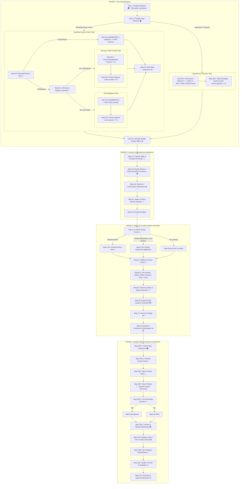

# 🗺️ Master Taxonomy Step Mapping Matrix (4-Phase Optimal UX Order Architecture)

## Overview
This matrix defines the **4-Phase Optimal UX Order Architecture**. Steps are ordered according to the student's natural cognitive decision journey:
1. **PHASE 1: Core Deal-Breakers** (College, Property Type, Room/Unit Type, Moving-in with Friends, Counters, Bed Setup, Budget Sliders)
2. **PHASE 2: Location & Infrastructure Resilience** (Campus Proximity, Nearby Stores, WiFi & Connectivity, Water & Power Backup, Parking)
3. **PHASE 3: Daily Life Comfort & Facilities** (Kitchen Setup, Shared/Private Kitchen Items, Bathroom CR Setup, Shower/Toilet Features, Shared Laundry/Water, Study/Caretaker, Aircon/Ventilation, Furniture/Study Desk)
4. **PHASE 4: Lifestyle Rules, Security & Submission** (House Rules Grouped in 5 Dynamic Sub-Steps, Safety & Security Features in 3 Sub-Steps, Summary & Search Submission)

---

## 🛠️ React Component Refactoring & File Strategy Architecture

To prevent creating 23 duplicate step files and keep the codebase 100% clean, DRY, and maintainable, the Search Modal implements a **Reusable Component Architecture**:

### 1. 🌟 Specialized Step Components (Kept & Refactored)
- `CollegeStep.tsx`: Renders dynamic `CampusCollege` landmarks dropdown & Leaflet map pins.
- `PropertyTypeStep.tsx`: Renders dynamic database `PropertyType` cards.
- `RoomTypeStep.tsx`: Renders decoupled room types (Solo vs. Bedspace) & *"Moving in together?"* question.
- `BudgetStep.tsx`: Renders Min/Max price range dual-sliders.
- `LocationStep.tsx`: Renders campus walk & transport proximity.
- `SummaryStep.tsx`: Renders filter summary review & search submission.

### 2. ⚡ New Reusable Step Components
- `DynamicAttributeStep.tsx`: Single reusable component handling all thematic attribute steps (WiFi, Backup, Parking, Kitchen, CR, Laundry, Study, Aircon, Furniture, Curfew, Visitor, Pet, Security). Accepts `kerbyPose`, `kerbyPrompt`, `items`, and `selectionMode`.
- `CounterStep.tsx`: Reusable counter component for `Room.availableSlots` and `Room.capacity` limit inputs.

### 3. 🧹 Legacy Monolithic Files Replaced
- `AmenitiesStep.tsx`, `RoomAmenitiesStep.tsx`, `RulesStep.tsx`, `AdvancedStep.tsx`: Replaced by `DynamicAttributeStep.tsx` to eliminate giant walls of checkboxes and prevent duplicate code.

---

## 🔄 4-Phase Natural Cognitive Flow Architecture

---

## 📋 Detailed Step Breakdown in Optimal UX Order

### 🟢 PHASE 1: Core Deal-Breakers (Steps 1 – 4)

#### Step 1: College & Campus Landmark Selection 🎓
* **Kerby Pose**: `kerby-waving.png` 👋
* **Kerby Prompt**: *"Mabuhay! 🎓 Which college or building in TAU will you be studying at?"*
* **Dynamic Database Items (All 9 TAU Landmarks)**:
  1. 🏛️ `Tarlac Agricultural University` (`TAU` - Campus Center: `15.635206, 120.415353`, logo: `/Tarlac_Agricultural_University_logo.png`)
  2. 💼 `TAU - College of Business and Management` (`CBM`: `15.634618, 120.415671`, logo: `/college/cbm.png`)
  3. 🩺 `TAU - College of Veterinary Medicine` (`CVM`: `15.635029, 120.416282`, logo: `/college/cvm.png`)
  4. 🏥 `TAU - College of Veterinary Medicine Annex Bldg.` (`CVM-ANNEX`: `15.639998, 120.419341`, logo: `/college/cvm.png`)
  5. 🌾 `TAU - College of Agriculture and Forestry` (`CAF`: `15.635696, 120.416857`, logo: `/college/caf.png`)
  6. 🔬 `TAU - College of Arts and Sciences` (`CAS`: `15.638563, 120.418229`, logo: `/college/cas.png`)
  7. ⚙️ `TAU - College of Engineering and Technology` (`CET`: `15.638729, 120.419395`, logo: `/college/cet.png`)
  8. 🎒 `TAU - Laboratory High School` (`LHS`: `15.639259, 120.420851`, logo: `/college/TAU - Laboratory High School.jpg`)
  9. 📚 `TAU - College of Education` (`CED`: `15.639881, 120.421095`, logo: `/college/coed.png`)

#### Step 2: Property Type Selection 🏠
* **Kerby Pose**: `kerby-pointing.png` 👉
* **Kerby Prompt**: *"Awesome! What property style feels like home to you?"*
* **Items**: `Boarding House`, `Apartment`, `Dormitory`, `Transient House`, `Agri-Hostel`.

---

#### 🏠 BRANCH A: Boarding House & Dormitory Path

##### Step 3A: Decoupled Room Type 🚪
* **Kerby Prompt**: *"Do you want a private Solo Room or budget Bedspace for your ${propertyType}?"*
* **Items**: `Solo Room (Private 1 Pax)`, `Bedspace (Shared Per Head)`.
* **Condition Engine**:
  * If `Solo Room`: System auto-sets `availableSlots = 1` and `capacity = 1`, and **SKIPS Steps 5A-1, 5A-2 & 5A-3**.
  * If `Bedspace`: System proceeds to **Step 5A-1 (Moving In Together Question)**.

##### Step 5A-1: Moving-In Together Conversational Question 👥 (Only Active for Bedspace)
* **Kerby Pose**: `kerby-thinking.png` 🤔
* **Kerby Prompt**: *"Are you moving into your bedspace alone, or are you moving in together with your friends/classmates?"*
* **Choices (2 Cards)**:
  1. 👥 `Yes, moving in with friends!`
  2. 👤 `No, just myself (solo bedspace)`

##### Step 5A-2: Available Bed Slots Needed Counter 🔢 (`Room.availableSlots`)
* **Kerby Pose**: `kerby-pointing.png`
* **Kerby Prompt**:
  * *If moving with friends*: *"How many empty bed slots do you and your friends need together in the same room?"*
  * *If moving alone*: Auto-sets `availableSlots = 1` and **SKIPS this step**.
* **Prisma Mapping**: `Room.availableSlots` (`$gte: slotsNeeded`)
* **Control**: `Counter.tsx` with `[ - ]` and `[ + ]` (e.g. 2, 3, 4 slots).

##### Step 5A-3: Room Capacity Limit Counter 🔢 (`Room.capacity`)
* **Kerby Pose**: `kerby-thinking.png` 🤔
* **Kerby Prompt**:
  * *If moving with friends*: *"What is the maximum room capacity limit you and your friends prefer for your Bedspace room?"*
  * *If moving alone*: *"What is the maximum room crowd size / capacity limit you prefer for your Bedspace room?"*
* **Prisma Mapping**: `Room.capacity` (`$lte: maxCapacity`)
* **Control**: `Counter.tsx` with `[ - ]` and `[ + ]` (e.g. max 2, 4, or 6 Pax room).

##### Step 4A: Bed Setup Preference 🛏️ (Room-Type Filtered Engine)
* **Kerby Pose**: `kerby-loving.png` 😍
* **Solo Room Setup**:
  * *Prompt*: *"What bed setup do you prefer for your private Solo Room?"*
  * *Choices*: `Single Bed Frame`, `Double Bed Frame`, `Any Bed Setup` *(Bunk Bed is EXCLUDED)*.
* **Bedspace Setup**:
  * *Prompt (Friends)*: *"What bed setup do you and your friends prefer in your Bedspace room?"*
  * *Prompt (Solo)*: *"What bed setup do you prefer for your Bedspace slot?"*
  * *Choices*: `Bunk Bed (Double Deck)`, `Single Bed Frame`, `Any Bed Setup`.

---

#### 🏢 BRANCH B: Apartment, Transient House & Agri-Hostel Path

##### Step 3B: Dynamic Unit Type Selection 🏢
* **Kerby Prompt**: *"Which unit layout do you prefer for your ${propertyType}?"*
* **Items by Property Type**:
  * **Apartment**: `Studio Unit`, `1-Bedroom Unit`, `2-Bedroom Unit`, `Whole House`.
  * **Transient House**: `Transient Room`, `Whole House`.
  * **Agri-Hostel**: `Hostel Suite`, `Hostel Group Suite`.

##### Step 5B-1: Total Occupants / Guest Capacity Counter 👥 (`Room.capacity`)
* **Kerby Pose**: `kerby-thinking.png` 🤔
* **Kerby Prompt**: *"How many total occupants or guests will be staying in your ${selectedRoomType || propertyType} unit?"* *(e.g. "How many total occupants or guests will be staying in your 2-Bedroom Unit?")*
* **Control**: `Counter.tsx` with `[ - ]` and `[ + ]` (e.g., 1 Pax, 2 Pax, 4 Pax Max Capacity).
* **Prisma Query**: `{ capacity: { $gte: Number(occupantsCount) } }`.

##### Step 4B: Private Unit Outdoor Spaces 🌅
* **Kerby Pose**: `kerby-pointing.png` 👉
* **Kerby Prompt**: *"What private outdoor spaces do you want for your ${selectedRoomType || propertyType}?"* *(e.g. "What private outdoor spaces do you want for your 2-Bedroom Unit?")*
* **Items**: `Private Balcony`, `Private Veranda / Terrace`, `Private Roof Deck`, `Private Garden / Yard`.

---

#### Step 4: Monthly Budget Range Sliders 💰 (Applies to ALL Property Types)
* **Kerby Prompt**: *"What is your monthly budget range for a ${propertyType} in Camiling?"*
* **Items**: Min Price & Max Price Sliders (`₱1,000 - ₱10,000`).

---

### 🔵 PHASE 2: Location & Infrastructure Resilience (Steps 5 – 9)

#### Step 5: Campus Walk & Transport Proximity 🚶🚌 (Section 5A-1 of `master_seed_data.md`)
* **Kerby Pose**: `kerby-pointing.png`
* **Kerby Prompt**: *"How close to TAU campus and transport terminals do you need your ${propertyType} to be?"*
* **Items**: `Walking Distance to Campus Gate`, `Near Tricycle Terminal`, `Near Jeepney Route`.

#### Step 6: Nearby Stores & Daily Essentials Proximity 🏪🍽️ (Section 5A-2 of `master_seed_data.md`)
* **Kerby Pose**: `kerby-pointing.png`
* **Kerby Prompt**: *"Which daily stores or eateries do you want near your ${propertyType}?"*
* **Items**: `Near Carinderia / Eatery`, `Near Sari-Sari Store`, `Near Convenience Store`, `Near Laundry Shop`, `Near Water Refilling Station`.

#### Step 7: Internet & Connectivity Preferences 💻⚡ (Section 5A-3a of `master_seed_data.md`)
* **Kerby Pose**: `kerby-studying.png` 🤓
* **Kerby Prompt**: *"What internet setup do you need for your ${propertyType}?"*
* **Items**: `Fiber WiFi`, `Wireless / Prepaid WiFi`.

#### Step 8: Water & Power Backup Systems 💧⚡ (Section 5A-3b of `master_seed_data.md`)
* **Kerby Pose**: `kerby-pointing.png` 👉
* **Kerby Prompt**: *"Which water supply and emergency power backup systems do you require for your ${propertyType}?"*
* **Items**: `Backup Generator`, `Overhead Water Tank`, `Electric Water Pump`, `Deep Well (Poso)`.

#### Step 9: Parking Facilities 🛵 (Section 5B of `master_seed_data.md`)
* **Kerby Pose**: `kerby-driving.png` 🛵
* **Kerby Prompt**: *"Are you bringing a vehicle or motorcycle to your ${propertyType}?"*
* **Items**: `Car Parking Slot`, `Private Covered Garage`, `Motorcycle Parking`, `Bicycle Rack`.

---

### 🟣 PHASE 3: Daily Life Comfort & Room Amenities (Step 7 Sub-Steps 7-1 – 7-6)

#### Step 7-1: Kitchen Setup Choice 🍳 (Active for Boarding House / Dorm - Mandatory Selection)
* **Tab Label**: `Kitchen Setup`
* **Kerby Pose**: `kerby-thinking.png` 🤔
* **Kerby Prompt**: *"Which kitchen & cooking arrangement do you prefer for your ${propertyType}?"*
* **Choices (3 Option Cards - Validation Required before Continue)**:
  1. 🧑‍🍳 `Private In-Room Kitchenette / Unit Kitchen` *(Cook/prep food inside your own room/unit)*
  2. 🍳 `Shared Common Kitchen` *(Cook in the shared hallway/ground floor kitchen)*
  3. 🍽️ `Any Kitchen Setup / No Preference` *(Either private kitchenette or shared kitchen is fine)*
* **Smart Default**: For **Apartment**, **Transient**, and **Agri-Hostel**, system automatically defaults to **`Private In-Room Kitchenette`** and proceeds directly to **Step 7-2**!

#### Step 7-2: Kitchen Features & Appliances 🧑‍🍳 (Adapts to Step 7-1 Choice)
* **Tab Label**: `Kitchen Features`
* **Kerby Pose**: `kerby-thinking.png` 🤔
* **Adapts Title & Items based on Step 7-1**:
  * *If Private Kitchenette*: Title *"Step 7-2: In-Unit Kitchen Features"* ➔ Shows `Kitchen Sink`, `Cooking Stove Provided`, `Personal Refrigerator`, `Personal Microwave`, `Personal Electric Kettle`, `Rice Cooker Provided`, `Complete Utensils & Dishware`, `Dish Drying Rack`.
  * *If Shared Kitchen*: Title *"Step 7-2: Shared Kitchen Amenities"* ➔ Shows `Shared Cooking Stove`, `Shared Refrigerator`, `Shared Microwave`, `Shared Electric Kettle`.
  * *If Any Kitchen Setup*: Title *"Step 7-2: Kitchen Features & Appliances"* ➔ Shows all kitchen appliances and cooking features.

#### Step 7-3: Bathroom Setup Choice 🚿 (Active for Boarding House / Dorm - Mandatory Selection)
* **Tab Label**: `Bathroom Setup`
* **Kerby Pose**: `kerby-loving.png` 😍
* **Kerby Prompt**: *"Which bathroom (CR) arrangement do you prefer?"*
* **Choices (3 Option Cards - Validation Required before Continue)**:
  1. 🚿 `Private Bathroom (CR) Inside Room` *(En Suite CR inside room)*
  2. 🚽 `Common Hallway Bathroom (CR)` *(Shared CR outside room)*
  3. 🧼 `Any Bathroom Setup` *(Either Private or Shared CR is fine)*
* **Smart Default**: For **Apartment**, **Transient**, and **Agri-Hostel**, system automatically defaults to **`Private Bathroom (CR) Inside Room`** and proceeds directly to **Step 7-4**!

#### Step 7-4: CR Features & Facilities 🚿🚽 (Adapts to Step 7-3 Choice)
* **Tab Label**: `CR Features`
* **Kerby Pose**: `kerby-loving.png` 😍
* **Adapts Title & Items based on Step 7-3**:
  * *If Private CR Inside Room*: Title *"Step 7-4: Private CR Fixtures"* ➔ Shows `Hot & Cold Shower Heater`, `Toilet Bidet`, `Exhaust Fan`, `Flush Toilet Bowl`, `Water Storage Drum (Tabo)`.
  * *If Common Hallway CR*: Title *"Step 7-4: Common CR Facilities"* ➔ Shows `Shared Shower Heater`, `Shared Bidet`, `Common Exhaust Fan`, `Water Storage Drum (Tabo)`.
  * *If Any CR Setup*: Title *"Step 7-4: Bathroom Features & Amenities"* ➔ Shows all bathroom fixtures & amenities.
* **UX Note**: Step 7-4 is **NEVER skipped**, ensuring boarders seeking budget accommodation with a common CR can still filter for essential amenities like hot showers or bidets!

#### Step 7-5: Aircon & Cooling ❄️🌀
* **Tab Label**: `Aircon & Cooling`
* **Kerby Pose**: `kerby-loving.png` 😍
* **Kerby Prompt**: *"Do you require air conditioning or fans inside your ${propertyType}?"*
* **Items**: `Inverter AC`, `Window Type AC`, `Split Type AC`, `Ceiling Fan`, `Stand Fan`, `Wall Fan`.

#### Step 7-6: Bedroom Furniture & Living Space 🛏️💻
* **Tab Label**: `Furniture`
* **Items**: `Study Desk`, `Study Chair`, `Lockable Closet`, `Storage Cabinet`, `Foam Mattress`, `Smart TV / Cable TV`, `Furnished Living Room & Sofa`, `Dining Table Set`, `Curtains`, `Window Blinds`, `Mosquito Window Screen`.

---

### 🟡 PHASE 4: Lifestyle Rules, Security & Search Submission (Steps 18A-1 – 20)

#### Step 18A-1: Who is the Property Tailored For? 🎓 (Tenant Type Cards)
* **Kerby Pose**: `kerby-thinking.png` 🤔
* **Kerby Prompt**: *"Who should the ${propertyType} be tailored for?"*
* **Items (3 Option Cards)**:
  1. 🎓 `Students Only` *(Strictly enrolled college students for a quiet study environment)*
  2. 💼 `Faculty & University Staff` *(Tailored for teachers and TAU employees)*
  3. 🤝 `Open to Everyone` *(Students, faculty, and general boarders)*

#### Step 18A-2: Property Gender Occupancy Policy 🚻 (Gender Policy Cards)
* **Kerby Pose**: `kerby-pointing.png` 👉
* **Kerby Prompt**: *"What gender occupancy rule do you prefer for your ${propertyType}?"*
* **Items (3 Option Cards)**:
  1. 🚺 `Female-Only Property` *(Entire building is 100% female boarders only)*
  2. 🚹 `Male-Only Property` *(Entire building is 100% male boarders only)*
  3. 👫 `Male & Female Allowed (Mixed)` *(Mixed male and female boarders in separate rooms/floors)*

#### Step 18B: Gate Access & Night Curfew Rules 🚪
* **Kerby Pose**: `kerby-sleeping.png` 😴
* **Kerby Prompt**: *"What gate access and curfew hours fit your schedule at your ${propertyType}?"*
* **Items (3 Clean Cards)**:
  * `24/7 Open Gate Access (No Curfew)`
  * `Night Curfew Enforced (10:00 PM)`
  * `Quiet Hours Enforced (10 PM - 6 AM)`

#### Step 18C: Visitor & Guest Policies 👤 (Dynamic Branching)
* **Kerby Pose**: `kerby-pointing.png` 👉
* **Dynamic Condition**:
  * *If `Male & Female Allowed (Mixed)` selected in Step 18A-2*:
    - **Kerby Prompt**: *"What visitor rules do you prefer for your mixed ${propertyType}?"*
    - **Choices (3 Cards)**: `Visitors Allowed`, `Male Guests Restricted from Female Rooms`, `Strictly No Outside Visitors`.
  * *If `Female-Only Property` or `Male-Only Property` selected in Step 18A-2*:
    - **Kerby Prompt**: *"What visitor rules do you prefer for your ${propertyType}?"*
    - **Choices (2 Cards)**: `Visitors Allowed`, `Strictly No Outside Visitors`.

#### Step 18D-1: Pet Ownership Question 🐶 (Conversational Option Cards)
* **Kerby Pose**: `kerby-thinking.png` 🤔
* **Kerby Prompt**: *"Are you bringing a pet with you to your ${propertyType}?"*
* **Choices (2 Cards)**:
  1. 🐶 `Yes, bringing a pet!` *(Filters listings with `Pets Allowed` rule)*
  2. 👤 `No pet` *(Auto-skips pet filter to show all available listings)*

#### Step 18D-2: Smoke & Alcohol Restrictions 🚭 (Multi-Select Checkboxes)
* **Tab Label**: `Smoke & Alcohol`
* **Kerby Pose**: `kerby-studying.png` 🤓
* **Kerby Prompt**: *"Do you require a smoke-free or alcohol-free environment for quiet studying?"*
* **Choices (2 Cards)**:
  * 🚭 `Strictly No Smoking / Vaping`
  * 🍺 `Strictly No Alcohol`

#### Step 19A: Building, Gate & Door Access Security 🔒 (Section 8 of `master_seed_data.md`)
* **Kerby Pose**: `kerby-pointing.png` 👉
* **Kerby Prompt**: *"What gate, door & building security features do you require for your ${propertyType}?"*
* **Items (5 Cards)**: `24/7 Security Guard`, `RFID Keycard Gate Access`, `RFID Keycard Door Lock`, `Biometric Main Door Access`, `CCTV Cameras`.

#### Step 19B: Fire & Disaster Preparedness 🧯 (Section 8 of `master_seed_data.md`)
* **Kerby Pose**: `kerby-thinking.png` 🤔
* **Kerby Prompt**: *"Which emergency preparedness and fire safety features do you need at your ${propertyType}?"*
* **Items (4 Cards)**: `Flood-Free Area`, `Fire Extinguisher Provided`, `Smoke Detector Installed`, `Emergency Hallway Light`.

#### Step 19C: Health, First Aid & Sanitation 🩺 (Section 8 of `master_seed_data.md`)
* **Kerby Pose**: `kerby-loving.png` 😍
* **Kerby Prompt**: *"Which health, first aid, and sanitation services do you prefer at your ${propertyType}?"*
* **Items (2 Cards)**: `First Aid Kit Available`, `Daily Waste Pickup`.

#### Step 20: Summary & Search Submission 🔍
* **Kerby Pose**: `kerby-excited.png` 🎉
* **Kerby Prompt**: *"All set! Ready to see your matched ${propertyType} listings?"*
* **Action**: Filter Summary Review & **`Search Properties 🔍`** Primary Button.
